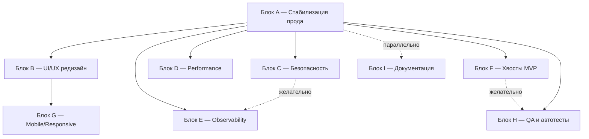

# Tech Roadmap Post-MVP — New Level Hub

> Стратегический документ от тех-директора тех-лиду. Основа для нарезки эпиков и спринтов в Linear.

---

## 1. Назначение документа

Этот документ — **карта блоков работ после закрытия MVP**. Он отвечает на три вопроса:

1. Что мы уже прошли (история).
2. Где мы сейчас (текущий блок).
3. Куда движемся дальше — в каком порядке, с какими целями и критериями готовности.

Документ **не нарезает тикеты** — это работа тех-лида. Документ задаёт **направления и Definition of Done на уровне блока**.

### Что считается вне скоупа этого роадмапа

Проект не уйдёт в долгую коммерческую эксплуатацию в ближайшее время. Поэтому **сознательно** не включаем то, что нужно только при длительной эксплуатации под реальной нагрузкой и реальными платежами:

- Биллинг и тарифы под реальные деньги (платежные провайдеры, выставление счетов, инвойсы).
- Compliance: 152-ФЗ / GDPR / SOC2 / ISO 27001.
- Внешний penetration test от вендора.
- Горизонтальное масштабирование, multi-region, read-replicas, CDN.
- Тяжёлая инфра-аналитика (ELK, Datadog, BigQuery).

Если эти направления понадобятся позже — заведём отдельный пост-роадмап "Production Hardening".

### Принципы работы с блоками

- **Один блок = один эпик в Linear.**
- Блок считается закрытым, только когда **выполнен Definition of Done блока**, а не "все тикеты в done".
- Параллелить можно только блоки, у которых `dependsOn` пуст или общий предок уже закрыт.
- Тех-лид перед стартом блока согласовывает с тех-директором: состав тикетов, оценку, параллелизацию.
- После закрытия блока — короткое retro (15 минут) и обновление этого документа: что реально вошло, что отложили, какие выводы.

---

## 2. Где мы сейчас (история)

| Блок | Что сделано | Артефакты |
|------|-------------|-----------|
| **Блок 0 — Foundation** | Backend-каркас: Django 4.2 + DRF + PostgreSQL + Docker. JWT-авторизация (SimpleJWT, ротация refresh). Кастомный `User` с ролями (`superadmin` / `company_admin` / `employee` / `guest`). CI/CD (GitHub Actions → SSH deploy). Авто-генерация OpenAPI (drf-spectacular). | [`CLAUDE.md`](CLAUDE.md), [`config/`](config/), [`apps/core/`](apps/core/) |
| **Блок 1 — Функционал MVP** | 7 продуктовых блоков из MVP-скоупа: пользователи и роли → компании (multi-tenancy) → бронирование ресурсов → CRM/портал → доступ и гостевые пропуска → сервисы здания → уведомления и аналитика. Заведены DEV-50…DEV-* тикеты по каждому блоку. | [`New_Level_Hub_MVP_Scope.md`](New_Level_Hub_MVP_Scope.md), [`scripts/linear-tickets.example.json`](scripts/linear-tickets.example.json) |
| **Блок 2 — Prod Review 15.05.2026** | Сборка регрессий и UX-багов после первого выхода на прод. Покрыты все роли (Superadmin / Company Admin / Employee / Guest) и зоны (dashboard, users, companies, resources, bookings, CRM, access, analytics, building, service requests, localization). | [`scripts/linear-tickets-prod-review-2026-05-15.json`](scripts/linear-tickets-prod-review-2026-05-15.json) |

---

## 3. Текущий блок (in progress)

### Блок A — Стабилизация прода

**Цель.** Закрыть оставшиеся тикеты Prod Review 15.05, устранить регрессии, получить чистый прод до старта Блока B.

**Что входит.**
- Закрытие всех тикетов с label `prod-review` из [`scripts/linear-tickets-prod-review-2026-05-15.json`](scripts/linear-tickets-prod-review-2026-05-15.json).
- Финальная русификация ошибок и UI-текстов в критичных user-flow (регистрация по инвайту, формы валидации, тексты ошибок API).
- Сквозная проверка ролей на проде: superadmin, company_admin, employee, guest.
- Hotfix-процесс: правила выкатки срочных правок без полного релизного цикла.

**Definition of Done.**
- Ноль открытых тикетов с label `prod-review` в Linear.
- Ручной регресс по чек-листу ролей пройден без блокеров.
- Все UI-сообщения об ошибках на русском, нет сырых англоязычных текстов от API в UI.
- Зафиксирован hotfix-процесс в [`CLAUDE.md`](CLAUDE.md) или в Runbook (готовится в Блоке I).

**Зависимости.** Нет. **Приоритет.** P0.

---

## 4. Дальнейшие блоки

Формат каждого блока:
- **Цель** — одна фраза.
- **Входной критерий** — что должно быть готово, чтобы стартовать.
- **Что входит** — направления работ (не тикеты).
- **Definition of Done блока** — измеримые выходные критерии.
- **Зависимости** — от каких блоков.
- **Приоритет** — P0 (нельзя пропустить) / P1 (важно) / P2 (желательно).

---

### Блок B — UI/UX редизайн

**Цель.** Уйти от шаблонных решений. Удобная, осмысленная, единая дизайн-система во всех модулях прода. Удобство > "красиво".

**Входной критерий.** Блок A закрыт (стабильный прод как база для редизайна).

**Что входит.**
- Дизайн-система: токены (цвета, типографика, отступы, радиусы, тени), базовая библиотека компонентов (кнопки, инпуты, селекты, модалки, тосты, табы, таблицы, чипы, бейджи).
- Прохождение по **каждой странице прода** (по ролям) с ре-дизайном: dashboard, users/employees, companies, resources, bookings, CRM (kanban + task detail), storage, HR, access/guest passes, building/services, notifications, analytics, settings.
- Единые состояния: loading skeleton, empty state, error state, permission-denied state.
- Accessibility-минимум: контраст AA, фокус-стейты, alt-тексты, semantic HTML, keyboard navigation на ключевых формах.
- Микроанимации и переходы (где они действительно помогают восприятию, а не "для красоты").
- Figma-эталон как single source of truth для фронта.

**Definition of Done блока.**
- Все страницы прода переведены на новую дизайн-систему (в каждой роли).
- Figma-файл с библиотекой компонентов и экранами актуален и согласован.
- Чек-лист доступности AA пройден на ключевых flow (логин, инвайт, бронирование, создание задачи CRM).
- Ноль регрессий по ролям (повторный обход тех же ролей, что в Блоке A).

**Зависимости.** A. **Приоритет.** P0.

---

### Блок C — Безопасность (dev-grade)

**Цель.** Закрыть базовый периметр безопасности на уровне разработки: ограничения, аудит, изоляция, секреты. Без вендорского pentest и legal compliance.

**Входной критерий.** Блок A закрыт.

**Что входит.**
- Rate limiting на критичные эндпоинты: login, password reset, invite accept, registration, OTP/email-verification.
- Audit log на чувствительные действия: вход от имени пользователя, изменение ролей, удаление компании/сотрудника, генерация guest pass, изменение настроек компании.
- Ревизия permissions и `CompanyIsolationMixin` на **всех** существующих ViewSet-ах (см. список в [`CLAUDE.md`](CLAUDE.md), раздел "Permission classes"). Чек-лист по каждому ViewSet: какой permission, какой isolation, есть ли unit-тест.
- Secrets management: `.env` не в git, ревизия истории git на утечки, ротация `SECRET_KEY` и DB-паролей, секреты CI/CD только в GitHub Actions Secrets.
- CORS/CSRF аудит: явный whitelist origin-ов, корректные cookie-флаги для refresh-токена (если перейдём на cookie-based refresh).
- Security headers: HSTS уже включён в проде — проверить остальные (Content-Security-Policy, X-Frame-Options, X-Content-Type-Options, Referrer-Policy).
- Унификация обработки ошибок: 401 на anonymous, 403 на wrong-role/wrong-company, никаких 500 с stacktrace в проде.

**Definition of Done блока.**
- Чек-лист безопасности (по пунктам выше) — зелёный, зафиксирован в Runbook.
- Unit-тесты на permissions и isolation существуют для каждого ViewSet (включая негативные кейсы: anonymous, guest, wrong company).
- Brute-force на login невозможен (rate limit срабатывает на E2E-тесте).
- Аудит истории git показал: нет коммитов с секретами в открытом виде.

**Зависимости.** A. **Приоритет.** P0 (можно параллелить с B).

---

### Блок D — Performance (dev-grade)

**Цель.** Устранить очевидные узкие места и N+1, чтобы прод был быстрым на dev-объёмах данных. Без подготовки к высокой нагрузке.

**Входной критерий.** Блок A закрыт.

**Что входит.**
- Сквозной аудит N+1 (Django Debug Toolbar / django-silk в локалке) по всем list-эндпоинтам.
- Расстановка `select_related` / `prefetch_related` по результатам аудита.
- Индексы по фактическим запросам: проверить slow query log в Postgres, добавить недостающие индексы.
- Базовое кэширование (`django.core.cache` + Redis, который уже есть как Celery broker) для дорогих read-only эндпоинтов и справочников.
- Ревизия Celery-задач: нет sync-вызовов внешних API из HTTP-обработчиков; всё, что > 200ms, уходит в очередь.
- Профайлинг 5 самых тяжёлых эндпоинтов (по логам прода или ощущениям) с цифрами "до / после".

**Definition of Done блока.**
- Ключевые list-эндпоинты отвечают ≤ 200ms на dev-данных (фиксированный seed).
- Django Debug Toolbar не показывает N+1 на основных страницах фронта.
- Документ "Performance baseline" с цифрами по 5 эндпоинтам зафиксирован в репо.

**Зависимости.** A. **Приоритет.** P1.

---

### Блок E — Observability

**Цель.** Видеть, что происходит на проде. Любая ошибка — алёрт; любой инцидент — диагностируется за минуты, а не часы.

**Входной критерий.** Блок A закрыт. Желательно — Блок C (чтобы аудит-логи писались в единый формат).

**Что входит.**
- Sentry на backend и frontend, привязка к user/company-контексту, source maps на фронте.
- Structured logging (JSON) с `request_id`, `user_id`, `company_id`, `role` в каждом логе.
- Базовые метрики: RPS, error rate, p95-latency по ключевым эндпоинтам (через Prometheus exporter или хотя бы middleware-метрики в БД).
- Алёрты в Telegram/Slack: рост error rate, всплески 5xx, падение healthcheck, фейл миграции при деплое.
- Healthcheck-эндпоинты уже есть ([`apps/core/`](apps/core/)) — проверить, что в них реальная проверка БД и Redis, а не просто 200.

**Definition of Done блока.**
- Любая необработанная ошибка прода видна в Sentry с контекстом пользователя и запроса.
- Тех-лид получает алёрт в течение 1 минуты при росте error-rate выше порога.
- Логи поискаемы по `request_id` сквозь backend и celery-worker.

**Зависимости.** A (и желательно C). **Приоритет.** P1.

---

### Блок F — Закрытие хвостов MVP

**Цель.** Закрыть всё, что осталось в статусе "TODO / stub" после Блока 1. Источник истины — секция "Known TODOs" в [`CLAUDE.md`](CLAUDE.md).

**Входной критерий.** Блок A закрыт.

**Что входит.**
- Email-верификация (есть `EmailVerificationToken` модель и стаб эндпоинта).
- Password reset flow (есть `PasswordResetToken` модель и стаб).
- `InviteRegistrationSerializer` — линковка пользователя к компании из инвайта, `role='employee'`.
- QR-генерация для guest passes (пакет `qrcode` уже установлен).
- Booking conflict validation.
- Recurring bookings — реальная логика, не только модель.
- `CompanyViewSet.deactivate` — деактивация всех сотрудников компании.
- WIP-лимиты в колонках CRM.
- Аналитические дашборды — заменить placeholder-данные на реальные агрегации (в [`apps/analytics/`](apps/analytics/) пока только views/serializers).
- Celery-задачи: email-уведомления, напоминания о бронированиях, авто-отмена просроченных бронирований.

**Definition of Done блока.**
- Все пункты из секции "Known TODOs" в [`CLAUDE.md`](CLAUDE.md) либо закрыты, либо явно помечены "перенесено в backlog" с обоснованием.
- Обновлён сам [`CLAUDE.md`](CLAUDE.md) — секция "Known TODOs" актуальна.
- На каждый закрытый пункт есть тест (минимум happy-path).

**Зависимости.** A. **Приоритет.** P1.

---

### Блок G — Mobile / Responsive

**Цель.** Прод корректно работает на мобильном для всех ролей. Не "мобильное приложение", а адаптив веб-платформы.

**Входной критерий.** Блок B закрыт (нет смысла адаптировать старый UI).

**Что входит.**
- Адаптив всех страниц прода под breakpoints 375 / 768 / 1024 / 1440px.
- Мобильная навигация (drawer / bottom-nav) — единое решение для всех ролей.
- Touch-оптимизация форм бронирования (выбор даты/времени) и CRM-канбана (drag-n-drop на тач-скринах).
- Адаптивные таблицы (карточный режим на мобилке вместо горизонтального скролла).

**Definition of Done блока.**
- Основные user-flow (логин, инвайт, бронирование, создание задачи, просмотр уведомлений) проходимы на 375px без горизонтального скролла и поломанной вёрстки.
- Чек-лист пройден на реальных устройствах (iOS Safari, Android Chrome) — не только в DevTools.

**Зависимости.** B. **Приоритет.** P2.

---

### Блок H — QA и автотесты

**Цель.** Сделать так, чтобы регрессии ловились автоматически, а не вручную при каждом prod review.

**Входной критерий.** Блок A закрыт. Желательно — Блок F (чтобы тестировать готовый функционал, а не stub'ы).

**Что входит.**
- Расширение pytest-покрытия по `apps/`. Приоритеты: permissions, `CompanyIsolationMixin`, бизнес-правила бронирования (конфликты, recurring), инвайты, инвайт→регистрация, role-transition (guest → employee).
- E2E-тесты на критичные flow: логин, инвайт-регистрация, создание бронирования, создание задачи CRM, генерация guest pass. Стек на выбор тех-лида (Playwright рекомендуется, но финальный выбор за ним).
- Регрессионный чек-лист по ролям как живой документ в репо — пополняется после каждого prod review.
- Нагрузочный smoke (locust или k6) на 5 ключевых эндпоинтов из Блока D — чтобы фиксировать деградации.

**Definition of Done блока.**
- Pytest coverage по `apps/` ≥ 70% (исключая migrations, admin, apps.py).
- E2E-тесты зелёные в CI на каждом PR в `main`.
- Регрессионный чек-лист по ролям лежит в репо и используется перед каждым релизом.
- Нагрузочный smoke запускается раз в неделю и не показывает деградации > 20% от baseline (Блок D).

**Зависимости.** A, желательно F. **Приоритет.** P1.

---

### Блок I — Внутренняя документация и onboarding для разработчиков

**Цель.** Новый разработчик поднимает проект и делает первый осмысленный PR за один рабочий день — без помощи тех-лида.

**Входной критерий.** Можно стартовать параллельно с любым блоком после A — обновляется по мере появления нового материала.

**Что входит.**
- Runbook: как поднять локально (шаги, типовые ошибки), как зайти на прод, что делать при инцидентах (rollback, restore из бэкапа, как читать Sentry).
- API-контракты для фронтенда сверх Swagger: примеры запросов/ответов, edge-cases, формат ошибок (`{"error": true, "status_code", "detail"}`), пагинация, фильтрация.
- ADR-summary (Architecture Decision Records): почему именно мульти-тенанси через FK, почему JWT, почему Celery+Redis, почему drf-spectacular — короткие "решение / альтернативы / последствия".
- Чек-лист код-ревью: что обязательно проверять (permissions, isolation, миграции, null-handling, тесты, OpenAPI-аннотации).
- Обновление [`CLAUDE.md`](CLAUDE.md) по мере закрытия Блоков C–H.

**Definition of Done блока.**
- Новый разработчик с нуля делает первый PR за рабочий день — проверено на реальном кейсе.
- Runbook покрывает топ-5 типовых инцидентов прошлого квартала.
- Чек-лист код-ревью реально используется (видно в комментариях к PR).

**Зависимости.** Нет жёстких. **Приоритет.** P2 (но стартует рано и тянется параллельно).

---

## 5. Что НЕ входит в роадмап (явно)

| Не делаем | Почему сейчас не делаем |
|-----------|-------------------------|
| Биллинг и тарифы под реальные платежи | Нет коммерческой эксплуатации в горизонте этого роадмапа |
| 152-ФЗ / GDPR / SOC2 / ISO 27001 | Legal-compliance работа имеет смысл только перед длительной эксплуатацией |
| Pentest от внешнего вендора | Дорого; делаем dev-grade security сами в Блоке C |
| Горизонтальное масштабирование, multi-region | Не упираемся в нагрузку на текущих объёмах |
| ELK / Datadog / BigQuery | Дорого; в Блоке E делаем минимально достаточное Sentry + Prometheus |
| Нативные мобильные приложения | Адаптивного веба в Блоке G достаточно |

Если какой-то пункт станет актуальным — выносим его в отдельный документ "Production Hardening Roadmap".

---

## 6. Карта зависимостей блоков

**Правила параллелизации:**
- После закрытия A можно параллельно стартовать B, C, D, E, F, H.
- G ждёт B (адаптируем уже новый UI).
- H лучше стартовать после F (тестировать реальный функционал, а не stub'ы), но можно и раньше — на permissions/isolation.
- I идёт фоном с любого момента после A.

---

## 7. Что делает тех-лид с этим документом

1. **Прочитать целиком.** Согласовать с тех-директором приоритеты P0/P1/P2 и порядок параллелизации.
2. **На каждый блок завести эпик в Linear** — название эпика = название блока (например, "Блок C — Безопасность").
3. **Нарезать тикеты внутри эпика** в формате существующих JSON-ов из [`scripts/`](scripts/):
   - `title`, `description`, `block` (= название блока), `labels`, `area`, `parallel`, `dependsOn`, `acceptanceCriteria`.
   - Каждый тикет — атомарный (1–3 дня работы), с проверяемыми acceptance criteria.
4. **Перед стартом блока** — короткая встреча с тех-директором: финальный состав тикетов, оценка, кто берёт.
5. **Во время блока** — еженедельный апдейт по прогрессу в Linear, эскалация блокеров.
6. **После закрытия блока** — retro (15 минут) + обновить этот документ:
   - Что реально вошло, что отложили и куда.
   - Какие выводы (что бы сделали иначе).
   - Передвинуть блок из "Дальнейшие" в "История".

---

## 8. История изменений документа

| Дата | Изменение | Автор |
|------|-----------|-------|
| 2026-05-20 | Первая версия. Блок A в работе, B–I в плане. | Тех-директор |
