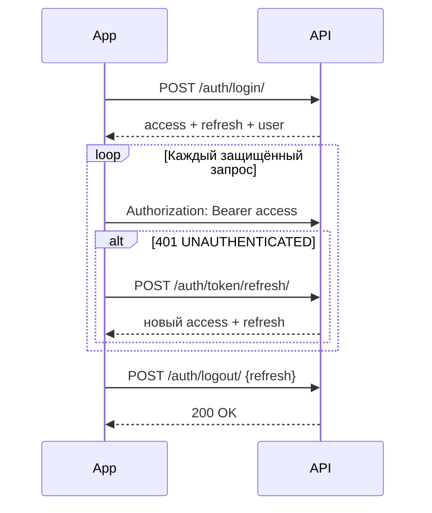

# New Level Hub — Mobile API Documentation

> Base URL: `https://your-domain.com/api/v1/`  
> Авторизация: JWT Bearer Token  
> Формат данных: JSON  
> Формат дат: ISO 8601 (`2024-01-15T10:30:00Z`)

Документация разбита по блокам: Auth — в этом файле, остальные секции — в отдельных файлах `mobile_api_<блок>.md`.

## Оглавление

1. [Auth — Регистрация, вход, JWT-токены](#auth--регистрация-вход-jwt-токены)
2. [Users — Профили пользователей](mobile_api_users.md)
3. [Core — Health, ping, dashboard, calendar](mobile_api_core.md)
4. [Companies — Компании и приглашения](mobile_api_companies.md)
5. [Bookings — Бронирование ресурсов](mobile_api_bookings.md)
6. [CRM — Задачи и доски](mobile_api_crm.md)
7. [Storage — Файлы и папки](mobile_api_storage.md)
8. [HR — Отпуска и онбординг](mobile_api_hr.md)
9. [Access — Гостевые пропуска](mobile_api_access.md)
10. [Services — Этажи, карта, заявки, объявления](mobile_api_services.md)
11. [Notifications — Уведомления](mobile_api_notifications.md)
12. [Analytics — Аналитика](mobile_api_analytics.md)

---

## Auth — Регистрация, вход, JWT-токены

Базовый префикс: `/api/v1/auth/`

---

### ✅ POST /api/v1/auth/register/

> Регистрация гостевого аккаунта (`role: guest`, без компании). Создаёт пользователя с `is_email_verified: false`, отправляет письмо с подтверждением email и сразу выдаёт JWT-токены.

🔓 Публичный

**Request**

```http
POST /api/v1/auth/register/
Content-Type: application/json
```

```json
{
  "email": "ivan.petrov@example.com",
  "first_name": "Иван",
  "last_name": "Петров",
  "phone": "+77001234567",
  "password": "SecurePass123!",
  "password_confirm": "SecurePass123!"
}
```

| Поле | Обязательно | Описание |
|------|-------------|----------|
| `email` | да | Уникальный email |
| `first_name` | да | Имя |
| `last_name` | да | Фамилия |
| `phone` | нет | Телефон (по умолчанию `""`) |
| `password` | да | Минимум 8 символов |
| `password_confirm` | да | Должен совпадать с `password` |

**Response 201**

```json
{
  "user": {
    "id": 42,
    "email": "ivan.petrov@example.com",
    "first_name": "Иван",
    "last_name": "Петров",
    "full_name": "Иван Петров",
    "phone": "+77001234567",
    "position": "",
    "avatar": null,
    "role": "guest",
    "company": null,
    "is_email_verified": false,
    "date_joined": "2024-01-15T10:30:00Z"
  },
  "tokens": {
    "access": "eyJhbGciOiJIUzI1NiIsInR5cCI6IkpXVCJ9...",
    "refresh": "eyJhbGciOiJIUzI1NiIsInR5cCI6IkpXVCJ9..."
  }
}
```

**Ошибки**

| Код | Когда | Что делать мобильщику |
|-----|-------|----------------------|
| 400 | Email уже занят, пароли не совпадают, слабый пароль | Показать ошибки из `error.details` по полям |
| 500 | Ошибка сервера | Показать экран ошибки, предложить повторить |

---

### ✅ GET /api/v1/auth/register/invite/

> Получить данные приглашения по токену из ссылки (перед экраном регистрации сотрудника).

🔓 Публичный

**Request**

```http
GET /api/v1/auth/register/invite/?token=3fa85f64-5717-4562-b3fc-2c963f66afa6
```

| Параметр | Обязательно | Описание |
|----------|-------------|----------|
| `token` | да | UUID токена приглашения |

**Response 200**

```json
{
  "company_name": "ТОО Астана Бизнес",
  "email": "new.employee@example.com",
  "role": "employee",
  "is_guest_upgrade": false
}
```

| Поле | Описание |
|------|----------|
| `company_name` | Название компании (`null` для приглашений building-staff без компании) |
| `email` | Email, на который отправлено приглашение (предзаполнить поле, не редактировать) |
| `role` | Роль, которую получит пользователь (`employee`, `company_admin`, `reception`, `service_manager`) |
| `is_guest_upgrade` | `true`, если существующий гостевой аккаунт будет повышен до сотрудника |

**Ошибки**

| Код | Когда | Что делать мобильщику |
|-----|-------|----------------------|
| 400 | Токен не передан, невалидный UUID, приглашение истекло или уже использовано | Показать «Ссылка приглашения недействительна» |
| 400 | Email уже зарегистрирован как активный сотрудник компании | Показать ошибку по полю `email` |

---

### ✅ POST /api/v1/auth/register/invite/

> Завершить регистрацию по приглашению. Создаёт нового пользователя или обновляет существующий гостевой аккаунт. Привязывает к компании и роли из приглашения.

🔓 Публичный

**Request**

```http
POST /api/v1/auth/register/invite/
Content-Type: application/json
```

```json
{
  "token": "3fa85f64-5717-4562-b3fc-2c963f66afa6",
  "first_name": "Айгуль",
  "last_name": "Серикова",
  "phone": "+77009876543",
  "password": "SecurePass123!"
}
```

| Поле | Обязательно | Описание |
|------|-------------|----------|
| `token` | да | UUID приглашения |
| `first_name` | да | Имя |
| `last_name` | да | Фамилия |
| `phone` | нет | Телефон |
| `password` | да | Минимум 8 символов |

**Response 201**

```json
{
  "detail": "Регистрация прошла успешно"
}
```

**Ошибки**

| Код | Когда | Что делать мобильщику |
|-----|-------|----------------------|
| 400 | Невалидный/истёкший/использованный токен | Показать ошибку приглашения |
| 400 | Превышен лимит сотрудников компании | Показать «Достигнут лимит участников» |
| 400 | Email уже занят другим активным пользователем | Показать ошибку по `email` |

---

### ✅ POST /api/v1/auth/login/

> Вход по email и паролю. Возвращает профиль и JWT-токены. Требует подтверждённый email.

🔓 Публичный

**Request**

```http
POST /api/v1/auth/login/
Content-Type: application/json
```

```json
{
  "email": "ivan.petrov@example.com",
  "password": "SecurePass123!",
  "remember_me": true
}
```

| Поле | Обязательно | Описание |
|------|-------------|----------|
| `email` | да | Email пользователя |
| `password` | да | Пароль |
| `remember_me` | нет | `false` (по умолчанию) — refresh 7 дней; `true` — refresh 30 дней |

**Response 200**

```json
{
  "user": {
    "id": 42,
    "email": "ivan.petrov@example.com",
    "first_name": "Иван",
    "last_name": "Петров",
    "full_name": "Иван Петров",
    "phone": "+77001234567",
    "position": "Менеджер",
    "avatar": null,
    "role": "employee",
    "company": {
      "id": 5,
      "name": "ТОО Астана Бизнес",
      "onboarding_completed": true
    },
    "is_email_verified": true,
    "date_joined": "2024-01-15T10:30:00Z"
  },
  "tokens": {
    "access": "eyJhbGciOiJIUzI1NiIsInR5cCI6IkpXVCJ9...",
    "refresh": "eyJhbGciOiJIUzI1NiIsInR5cCI6IkpXVCJ9..."
  }
}
```

**Ошибки**

| Код | Когда | Что делать мобильщику |
|-----|-------|----------------------|
| 400 | Неверный email или пароль | Показать «Неверные учётные данные» |
| 403 | Email не подтверждён (`EMAIL_NOT_VERIFIED`) | Перейти на экран подтверждения email, предложить `/auth/email/resend/` |
| 403 | Аккаунт заблокирован (`is_active: false`) | Показать «Аккаунт заблокирован», связаться с поддержкой |

---

### ✅ POST /api/v1/auth/logout/

> Выход из системы. Добавляет refresh-токен в чёрный список. После logout старый refresh нельзя использовать для обновления.

🔓 Публичный (токен передаётся в теле, не в Authorization)

**Request**

```http
POST /api/v1/auth/logout/
Content-Type: application/json
```

```json
{
  "refresh": "eyJhbGciOiJIUzI1NiIsInR5cCI6IkpXVCJ9..."
}
```

**Response 200**

```json
{
  "detail": "Вы успешно вышли из системы"
}
```

**Ошибки**

| Код | Когда | Что делать мобильщику |
|-----|-------|----------------------|
| 400 | `refresh` не передан или токен невалиден | Очистить локальные токены и перейти на экран входа |

---

### ✅ POST /api/v1/auth/token/refresh/

> Обновить access-токен (и получить новый refresh при ротации). Сохраняет флаг `remember_me` из исходного refresh-токена.

🔓 Публичный

**Request**

```http
POST /api/v1/auth/token/refresh/
Content-Type: application/json
```

```json
{
  "refresh": "eyJhbGciOiJIUzI1NiIsInR5cCI6IkpXVCJ9..."
}
```

**Response 200**

```json
{
  "access": "eyJhbGciOiJIUzI1NiIsInR5cCI6IkpXVCJ9...",
  "refresh": "eyJhbGciOiJIUzI1NiIsInR5cCI6IkpXVCJ9..."
}
```

**Ошибки**

| Код | Когда | Что делать мобильщику |
|-----|-------|----------------------|
| 400 | `refresh` не передан | Проверить локальное хранилище токенов |
| 401 | Refresh истёк, в чёрном списке или сессия превысила idle/absolute timeout | Очистить токены, перейти на экран входа |
| 401 | Код `SESSION_IDLE_TIMEOUT` | Сессия истекла по неактивности — повторный вход |
| 401 | Код `SESSION_ABSOLUTE_TIMEOUT` | Сессия истекла по абсолютному лимиту — повторный вход |

---

### ✅ GET /api/v1/auth/email/verify/

> Подтвердить email по одноразовому токену из письма. Обычно открывается по deep link; можно вызвать из приложения, передав `token` из URL.

🔓 Публичный

**Request**

```http
GET /api/v1/auth/email/verify/?token=7c9e6679-7425-40de-944b-e07fc1f90ae7
```

| Параметр | Обязательно | Описание |
|----------|-------------|----------|
| `token` | да | UUID токена верификации |

**Response 200**

```json
{
  "detail": "Email подтверждён"
}
```

**Ошибки**

| Код | Когда | Что делать мобильщику |
|-----|-------|----------------------|
| 400 | Токен уже использован (`TOKEN_ALREADY_USED`) | Показать «Email уже подтверждён» |
| 400 | Токен истёк (`TOKEN_EXPIRED`) | Предложить запросить новое письмо через `/auth/email/resend/` |
| 404 | Токен не найден | Показать «Ссылка недействительна» |

---

### ✅ POST /api/v1/auth/email/resend/

> Повторно отправить письмо с подтверждением email текущему авторизованному пользователю.

🔒 Требует авторизации

**Request**

```http
POST /api/v1/auth/email/resend/
Authorization: Bearer <access_token>
```

**Response 200**

```json
{
  "detail": "Письмо с подтверждением отправлено"
}
```

**Ошибки**

| Код | Когда | Что делать мобильщику |
|-----|-------|----------------------|
| 401 | Токен истёк | Вызвать `/auth/token/refresh/` |
| 403 | Email уже подтверждён | Перейти в основное приложение |
| 429 | Более 3 запросов за 10 минут | Показать «Слишком много запросов, попробуйте позже» |

---

### ✅ POST /api/v1/auth/password/reset/

> Запросить сброс пароля. Письмо отправляется только если активный аккаунт с таким email существует. Ответ всегда `200` (защита от перебора email).

🔓 Публичный

**Request**

```http
POST /api/v1/auth/password/reset/
Content-Type: application/json
```

```json
{
  "email": "ivan.petrov@example.com"
}
```

**Response 200**

```json
{
  "detail": "Если аккаунт с таким email существует, мы отправили ссылку для сброса пароля"
}
```

**Ошибки**

| Код | Когда | Что делать мобильщику |
|-----|-------|----------------------|
| 400 | Невалидный формат email | Показать ошибку валидации |
| 429 | Более 5 запросов с одного IP за 15 минут | Показать «Слишком много запросов» |

---

### ✅ POST /api/v1/auth/password/reset/confirm/

> Установить новый пароль по токену из письма. Инвалидирует все активные refresh-сессии пользователя.

🔓 Публичный

**Request**

```http
POST /api/v1/auth/password/reset/confirm/
Content-Type: application/json
```

```json
{
  "token": "9b1deb4d-3b7d-4bad-9bdd-2b0d7b3dcb6d",
  "new_password": "NewSecurePass456!"
}
```

| Поле | Обязательно | Описание |
|------|-------------|----------|
| `token` | да | UUID из ссылки сброса (срок действия — 1 час) |
| `new_password` | да | Минимум 8 символов, должны пройти Django password validators |

**Response 200**

```json
{
  "detail": "Пароль успешно изменён"
}
```

**Ошибки**

| Код | Когда | Что делать мобильщику |
|-----|-------|----------------------|
| 400 | Токен невалиден (`TOKEN_INVALID`) | Показать «Ссылка недействительна» |
| 400 | Токен истёк (`TOKEN_EXPIRED`) | Предложить запросить новый сброс |
| 400 | Токен уже использован (`TOKEN_ALREADY_USED`) | Предложить запросить новый сброс |
| 400 | Слабый пароль | Показать требования к паролю из `error.details` |

---

### Важные детали для мобильщиков (Auth)

#### JWT-токены

| Токен | Назначение | Срок жизни (по умолчанию) |
|-------|------------|---------------------------|
| `access` | Заголовок `Authorization: Bearer <access>` для всех защищённых запросов | 15 минут |
| `refresh` | Обновление пары через `/auth/token/refresh/` | 7 дней (30 дней при `remember_me: true`) |

- Храните оба токена в secure storage (Keychain / Keystore).
- При login/register сервер выставляет HttpOnly-cookie `refresh_token` — **мобильному клиенту используйте `tokens.refresh` из тела ответа**, cookie предназначена для веба.
- Refresh-токены **ротируются**: после каждого успешного `/auth/token/refresh/` сохраняйте новый `refresh`, старый становится недействительным.

#### Сессионные ограничения

Помимо срока жизни JWT действуют серверные лимиты:

- **Idle timeout** — 5 минут неактивности (сбрасывается при успешных авторизованных запросах).
- **Absolute timeout** — 15 минут с момента создания сессии (login / refresh).

При превышении API вернёт `401` с кодами `SESSION_IDLE_TIMEOUT` или `SESSION_ABSOLUTE_TIMEOUT` — очистите токены и покажите экран входа.

#### Объект `user` в ответах login/register

```json
{
  "id": 42,
  "email": "ivan.petrov@example.com",
  "first_name": "Иван",
  "last_name": "Петров",
  "full_name": "Иван Петров",
  "phone": "+77001234567",
  "position": "",
  "avatar": "https://your-domain.com/media/avatars/42/photo.jpg",
  "role": "guest",
  "company": null,
  "is_email_verified": false,
  "date_joined": "2024-01-15T10:30:00Z"
}
```

- `company` — объект `{ "id": 5, "name": "ТОО Астана Бизнес", "onboarding_completed": true }` или `null`.
- Роли: `superadmin`, `company_admin`, `employee`, `reception`, `service_manager`, `guest`.

#### Формат ошибок

Большинство ошибок валидации — в конверте `{ "success": false, "error": { "code", "message", "details" } }`.  
Эндпоинты logout, verify email, password reset могут вернуть упрощённый `{"detail": "..."}`.  
Локализация: заголовок `Accept-Language: ru` или `en` (по умолчанию `ru`).

#### Особенности сценариев

| Сценарий | Поведение |
|----------|-----------|
| `POST /register/` | Выдаёт токены сразу, но `is_email_verified: false`. Login заблокирован до верификации. |
| `POST /register/invite/` | **Токены не выдаёт.** После регистрации — экран «Подтвердите email», затем `/login/`. |
| `POST /login/` | Требует `is_email_verified: true`, иначе `403 EMAIL_NOT_VERIFIED`. |
| `POST /token/refresh/` | При `401 UNAUTHENTICATED` — одна попытка refresh, затем повторный вход. |
| `POST /password/reset/confirm/` | Инвалидирует все refresh-сессии — очистите локальные токены. |
| `POST /logout/` | Передайте `refresh` в теле; даже при ошибке 400 можно очистить локальные токены. |

#### Рекомендуемый flow



---
