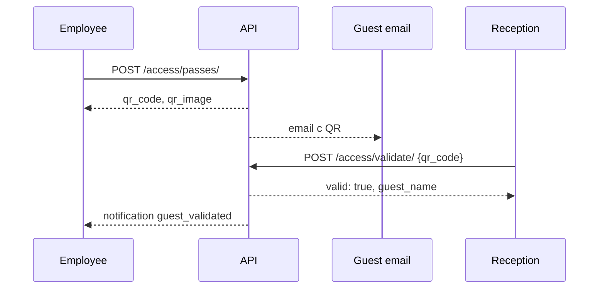

# Access — Гостевые пропуска

> Базовый префикс: `/api/v1/access/`  
> Подключение: [← Основная документация](mobile_api.md)

Гостевые QR-пропуска, проверка на ресепшене, журнал проходов.

---

## Гостевые пропуска (Passes)

### ✅ GET /api/v1/access/passes/

> Список пропусков. Employee — только свои; `company_admin` — все пропуски компании.

🔒 `guest`, `employee`, `company_admin`, `superadmin`

**Request**

```http
GET /api/v1/access/passes/?status=active&created_by=42&date_from=2024-06-01&valid_from_after=2024-06-15
Authorization: Bearer <access_token>
```

| Параметр | Описание |
|----------|----------|
| `status` | `active`, `used`, `expired`, `revoked` |
| `company_id` | Только `superadmin` |
| `company_name` | Поиск по названию компании |
| `created_by` | ID создателя |
| `created_by_email` | Email создателя |
| `date_from`, `date_to` | По дате создания |
| `valid_from_after`, `valid_from_before` | По началу действия |

**Response 200** — пагинированный список:

```json
{
  "count": 1,
  "results": [
    {
      "id": 12,
      "created_by": 42,
      "created_by_name": "Иван Петров",
      "created_by_email": "ivan@company.com",
      "created_by_company_name": "ACME",
      "company": 5,
      "guest_name": "Анна Гость",
      "guest_email": "anna.guest@mail.com",
      "guest_phone": "+77001234567",
      "purpose": "Встреча с командой",
      "qr_code": "a1b2c3d4-e5f6-7890-abcd-ef1234567890",
      "qr_image": "https://your-domain.com/media/guest-passes/qr/12/qr.png",
      "status": "active",
      "usage_type": "single",
      "is_single_use": true,
      "times_used": 0,
      "valid_from": "2024-06-15T09:00:00Z",
      "valid_until": "2024-06-15T18:00:00Z",
      "is_valid": true,
      "created_at": "2024-06-14T16:00:00Z",
      "last_validated_at": null,
      "last_validated_by": null,
      "last_method": null
    }
  ]
}
```

---

### ✅ POST /api/v1/access/passes/

> Создать гостевой пропуск. QR генерируется автоматически, email гостю отправляется асинхронно.

**Request**

```json
{
  "guest_name": "Анна Гость",
  "guest_email": "anna.guest@mail.com",
  "guest_phone": "+77001234567",
  "purpose": "Встреча с командой",
  "valid_from": "2024-06-15T09:00:00Z",
  "valid_until": "2024-06-15T18:00:00Z",
  "is_single_use": true
}
```

| Поле | Обязательно | Описание |
|------|-------------|----------|
| `guest_name` | да | ФИО гостя |
| `guest_email` | да | Email для отправки QR |
| `guest_phone` | нет | Телефон |
| `purpose` | нет | Цель визита |
| `valid_from` | нет | Default: сейчас |
| `valid_until` | да | Конец действия |
| `is_single_use` | да | `true` = одноразовый, `false` = многоразовый |

| Ограничение | Значение |
|-------------|----------|
| Макс. срок | **30 дней** от `valid_from` |
| Multi-use | Не более **1 суток** (`valid_until - valid_from ≤ 24ч`) |
| Email | Нельзя свой email или email сотрудника (не `guest`) |

**Лимиты активных пропусков**

| Кто | Лимит |
|-----|-------|
| `guest` | Макс. **2** active всего |
| `employee` (plan `basic`) | Макс. **2** active на один `guest_email` в компании |
| `employee` (plan `standard`/`premium`) | Без лимита |
| `company_admin`, `superadmin` | Без лимита |

**Response 201** — полный объект `GuestPassSerializer`.

---

### ✅ GET /api/v1/access/passes/{id}/

> Детали пропуска (включая `qr_code`, `qr_image`).

---

### ✅ POST /api/v1/access/passes/{id}/revoke/

> Отозвать активный пропуск.

🔒 `company_admin`, `superadmin`

**Response 200**

```json
{
  "detail": "Пропуск отозван"
}
```

| Код | Когда |
|-----|-------|
| 400 | Статус `used` или `expired` |

---

### ✅ POST /api/v1/access/passes/{id}/resend/

> Повторно отправить QR на email гостя.

🔒 `company_admin`, `superadmin`

| Ограничение | Значение |
|-------------|----------|
| Статус | Только `active` |
| Rate limit | **3** раза в час на пропуск |

**Response 200** — `{ "detail": "..." }`  
**Response 429** — превышен лимит resend

---

### ✅ GET /api/v1/access/passes/{id}/validations/

> История сканирований пропуска.

🔒 Создатель, `company_admin` компании, `superadmin`

**Response 200**

```json
{
  "total": 1,
  "results": [
    {
      "id": 88,
      "validated_at": "2024-06-15T10:30:00Z",
      "validated_by": "Мария Ресепшен",
      "method": "qr",
      "entry_point": ""
    }
  ]
}
```

> `total` = `times_used` пропуска.

---

### ✅ GET /api/v1/access/passes/export/

> Экспорт пропусков в CSV.

🔒 `company_admin`, `superadmin`

**Response 200** — `text/csv`, attachment `guest_passes_YYYY-MM-DD.csv`

---

### ✅ GET /api/v1/access/passes/qr/{qr_code}/image/

> PNG-изображение QR (публичный URL для email-клиентов).

🔓 Без авторизации

**Response 200** — `image/png`  
**Response 404** — пропуск не найден, `revoked` или `expired`

---

## Проверка QR (ресепшен)

### ✅ POST /api/v1/access/validate/

> Сканирование QR на входе. Фиксирует проход и уведомляет создателя.

🔒 `reception`, `superadmin`

**Request**

```json
{
  "qr_code": "a1b2c3d4-e5f6-7890-abcd-ef1234567890"
}
```

**Response 200 — успех**

```json
{
  "valid": true,
  "guest_name": "Анна Гость",
  "purpose": "Встреча с командой",
  "invited_by": "Иван Петров",
  "valid_from": "2024-06-15T09:00:00Z",
  "valid_until": "2024-06-15T18:00:00Z"
}
```

**Response 200 — отказ** (не ошибка HTTP):

```json
{
  "valid": false,
  "reason": "expired"
}
```

| `reason` | Описание |
|----------|----------|
| `not_found` | QR не найден |
| `not_yet_active` | Ещё не начался (+ `available_from`) |
| `expired` | Истёк срок |
| `revoked` | Отозван |
| `already_used` | Одноразовый уже использован |

> При `valid: true`: `times_used++`, для `single` → `status: used`, создаётся `AccessLog`, push создателю (`guest_validated`).

---

## Журнал проходов (Access Logs)

### ✅ GET /api/v1/access/logs/

> Журнал валидаций и ручных записей.

🔒 `company_admin`, `superadmin`

**Request**

```http
GET /api/v1/access/logs/?company_id=5&date_from=2024-06-01&date_to=2024-06-30&search=Анна&method=qr
```

| Параметр | Описание |
|----------|----------|
| `company_id` | Только `superadmin` |
| `date_from`, `date_to` | По `created_at` |
| `method` | `qr`, `manual` |
| `is_entry` | `true` / `false` |
| `search` | По имени/email гостя |

**Response 200** — пагинированный список:

```json
{
  "count": 1,
  "results": [
    {
      "id": 88,
      "guest_pass": 12,
      "user": null,
      "checked_by": 3,
      "entry_point": "Главный вход",
      "method": "qr",
      "is_entry": true,
      "created_at": "2024-06-15T10:30:00Z",
      "invited_by": "Иван Петров",
      "validated_at": "2024-06-15T10:30:00Z",
      "validated_by": "Мария Ресепшен"
    }
  ]
}
```

---

### ✅ POST /api/v1/access/logs/

> Ручная запись прохода (без QR).

🔒 `company_admin`, `superadmin`

**Request**

```json
{
  "guest_pass": 12,
  "entry_point": "Главный вход",
  "method": "manual",
  "is_entry": true
}
```

**Response 201** — объект `AccessLogSerializer`.

---

### ✅ GET /api/v1/access/logs/export/

> Экспорт журнала в CSV.

🔒 `company_admin`, `superadmin`

**Request**

```http
GET /api/v1/access/logs/export/?date_from=2024-06-01&date_to=2024-06-30&lang=ru
```

**Response 200** — `access_logs_YYYY-MM-DD.csv` (UTF-8 BOM для Excel)

---

### Важные детали для мобильщиков (Access)

#### Доступ по ролям

| Роль | Создать/список пропусков | Validate QR | Журнал / export |
|------|--------------------------|-------------|-----------------|
| `guest` | Свои (макс. 2 active) | — | — |
| `employee` | Свои | — | — |
| `company_admin` | Все компании + revoke/resend | — | Да |
| `reception` | — | **Да** | — |
| `superadmin` | Всё | Да | Всё |
| `service_manager` | **403** | **403** | **403** |

#### Мобильные экраны → эндпоинты

| Экран | Эндпоинты |
|-------|-----------|
| Мои пропуска | `GET /access/passes/` |
| Создать пропуск | `POST /access/passes/` |
| Показать QR | `qr_image` из ответа или `/passes/qr/{uuid}/image/` |
| Детали + история | `GET /passes/{id}/`, `GET /passes/{id}/validations/` |
| Ресепшен-сканер | `POST /access/validate/` |
| Админ: все пропуска | `GET /passes/?status=active` |
| Админ: журнал | `GET /access/logs/` |

#### Типы использования

| `is_single_use` | `usage_type` | Поведение |
|-----------------|--------------|-----------|
| `true` | `single` | Один вход → `status: used` |
| `false` | `multi` | Несколько входов в пределах срока (макс. 1 день) |

`is_valid` в ответе учитывает статус, даты и `times_used`.

#### QR для гостя

1. При создании — Celery отправляет email с QR.
2. `qr_image` — URL PNG на сервере (публичный эндпоинт по `qr_code`).
3. `resend` — повторная отправка (admin, 3/час).
4. Гость **не логинится** в приложение — QR приходит на email.

#### Уведомления

| Событие | Кому | `notification_type` |
|---------|------|---------------------|
| QR отсканирован | Создатель пропуска | `guest_validated` |

#### Рекомендуемый flow



#### Тарифные лимиты (employee)

На тарифе `basic` — не более 2 активных пропусков на один email гостя. На `standard`/`premium` лимит снят. `company_admin` не ограничен.

#### Ограничения

- Пропуски: только GET/POST (нет PATCH/DELETE).
- `validate` всегда возвращает **200** — проверяйте поле `valid`.
- Журнал и CSV-export — только для админов.
- `reception` не может создавать пропуска, только валидировать.

---
