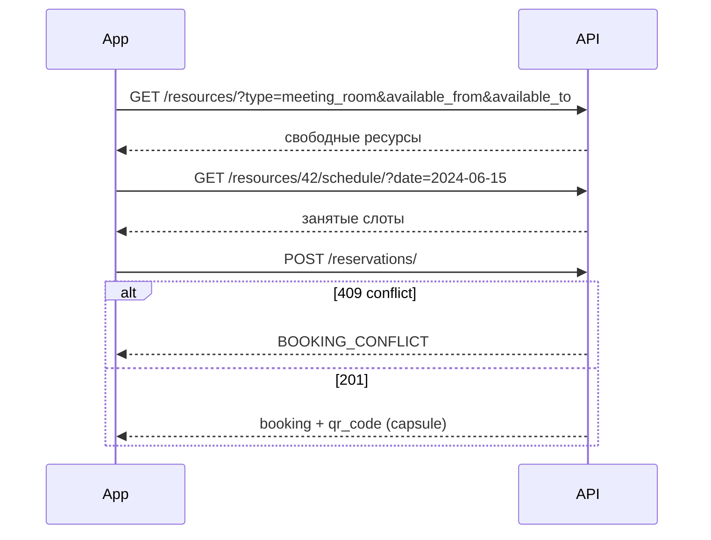

# Bookings — Бронирование ресурсов

> Базовый префикс: `/api/v1/bookings/`  
> Подключение: [← Основная документация](mobile_api.md)

Каталог ресурсов (столы, переговорные, парковка, капсулы), бронирования, повторяющиеся серии и QR-доступ.

> **Важно:** бронирования в API называются `reservations`, не `bookings`.

---

## Ресурсы (Resources)

### ✅ GET /api/v1/bookings/resources/

> Каталог доступных ресурсов с live-статусом (`free`, `occupied`, `soon_available`, `blocked`).

🔒 Требует авторизации · все роли, включая `guest`

**Request**

```http
GET /api/v1/bookings/resources/?type=meeting_room&floor=3&capacity_min=4&available_from=2024-06-15T09:00:00+06:00&available_to=2024-06-15T11:00:00+06:00&ordering=name&page=1
Authorization: Bearer <access_token>
```

| Параметр | Описание |
|----------|----------|
| `type` / `resource_type` | `desk`, `meeting_room`, `parking`, `capsule` |
| `floor` | Номер этажа |
| `capacity_min`, `capacity_max` | Вместимость (для переговорных) |
| `equipment` | Через запятую: `projector,whiteboard,tv,...` |
| `has_projector`, `has_tv`, `has_video_conf` | Булевы фильтры |
| `available_from`, `available_to` | ISO 8601 — исключить занятые ресурсы в интервале (оба обязательны) |
| `search` | Поиск по `name` |
| `ordering` | `name`, `floor`, `capacity`, `id` (с `-` для desc) |
| `is_active` | Только `superadmin` (остальным всегда активные) |

**Response 200**

```json
{
  "count": 24,
  "next": null,
  "previous": null,
  "meeting_room_equipment_keys": ["projector", "whiteboard", "video_conf"],
  "results": [
    {
      "id": 42,
      "type": "meeting_room",
      "name": "Переговорная A-201",
      "floor_id": 3,
      "floor_number": 3,
      "floor_name": "Этаж 3",
      "zone": "Open Space",
      "photo": null,
      "photo_url": "https://your-domain.com/media/resources/room.jpg",
      "photos": [],
      "capacity": 8,
      "equipment": {
        "projector": true,
        "tv": false,
        "whiteboard": true,
        "video_conf": true,
        "monitor": false,
        "dock": false,
        "power_outlet": true
      },
      "is_active": true,
      "is_hot_desk": false,
      "availability_days": [0, 1, 2, 3, 4],
      "parking_type": null,
      "capsule_zone": "",
      "assigned_company": null,
      "assigned_company_name": null,
      "status": "free",
      "reason": null,
      "available_at": null
    }
  ]
}
```

| Поле `status` | Значение |
|---------------|----------|
| `free` | Свободен сейчас |
| `occupied` | Занят подтверждённым бронированием |
| `soon_available` | Занят, но скоро освободится (`available_at` — когда) |
| `blocked` | Админ-блокировка (`reason` — причина) |

---

### ✅ GET /api/v1/bookings/resources/{id}/

> Детальная карточка ресурса + занятые слоты на 7 дней + галерея фото.

🔒 Требует авторизации

**Response 200** — поля ресурса +:

```json
{
  "schedule": [
    {
      "start": "2024-06-15T09:00:00+06:00",
      "end": "2024-06-15T10:00:00+06:00",
      "booking_id": 101,
      "user_name": "Иван Петров"
    }
  ],
  "photos": [
    {
      "id": 1,
      "image": "/media/resource_photos/1.jpg",
      "image_url": "https://your-domain.com/media/resource_photos/1.jpg",
      "created_at": "2024-05-01T08:00:00Z"
    }
  ]
}
```

---

### ✅ GET /api/v1/bookings/resources/{id}/schedule/

> Расписание бронирований ресурса на день или неделю.

🔒 Требует авторизации

**Request**

```http
GET /api/v1/bookings/resources/42/schedule/?date=2024-06-15
GET /api/v1/bookings/resources/42/schedule/?week=2024-06-10
```

| Параметр | Описание |
|----------|----------|
| `date` | `YYYY-MM-DD` (по умолчанию — сегодня, Asia/Almaty) |
| `week` | Любая дата недели — вернёт слоты пн–вс этой недели |

**Response 200**

```json
[
  {
    "booking_id": 101,
    "start": "2024-06-15T09:00:00+06:00",
    "end": "2024-06-15T10:00:00+06:00",
    "status": "upcoming"
  }
]
```

---

### Superadmin: управление ресурсами

| Метод | URL | Описание |
|-------|-----|----------|
| POST | `/resources/` | Создать ресурс |
| PATCH | `/resources/{id}/` | Обновить |
| DELETE | `/resources/{id}/` | Удалить (если нет будущих бронирований) |
| POST | `/resources/{id}/activate/` | Активировать |
| POST | `/resources/{id}/deactivate/` | Деактивировать (+ отмена будущих броней) |
| POST | `/resources/bulk-create/` | Массовое создание из шаблона |
| POST | `/resources/{id}/block/` | Заблокировать интервал |
| GET | `/resources/{id}/blocks/` | Список блокировок |
| DELETE | `/resources/{id}/blocks/{block_id}/` | Снять блокировку |
| POST | `/resources/{id}/photos/` | Загрузить фото (`multipart`) |
| DELETE | `/resources/{id}/photos/{photo_id}/` | Удалить фото |

🔒 Только `superadmin` (кроме bulk-activate/deactivate/delete на ресурсах — `company_admin`).

---

## Бронирования (Reservations)

### ✅ GET /api/v1/bookings/reservations/

> Список бронирований с фильтрами. `employee`/`company_admin` — своя компания + брони, где пользователь участник. `guest` — только свои и как участник.

🔒 Требует авторизации · `IsGuestOrCompanyMember`

**Request**

```http
GET /api/v1/bookings/reservations/?status=confirmed&resource_type=desk&date_from=2024-06-01T00:00:00+06:00&date_to=2024-06-30T23:59:59+06:00&ordering=-start_time
Authorization: Bearer <access_token>
```

| Параметр | Описание |
|----------|----------|
| `status` | `confirmed`, `cancelled`, `completed`, `no_show` |
| `resource_type` | `desk`, `meeting_room`, `parking`, `capsule` |
| `resource`, `user`, `company` | ID фильтры |
| `date_from` | `start_time >=` |
| `date_to` | `end_time <=` |
| `ordering` | `start_time`, `-start_time`, `created_at`, `-created_at` |

**Response 200** — пагинированный список объектов бронирования (см. ниже).

---

### ✅ GET /api/v1/bookings/reservations/my/

> Мои бронирования (владелец или участник). Удобнее для мобильного «Мои брони».

🔒 Требует авторизации

**Request**

```http
GET /api/v1/bookings/reservations/my/?status=upcoming&resource_type=meeting_room
Authorization: Bearer <access_token>
```

| Параметр | Описание |
|----------|----------|
| `status` | `upcoming`, `past`, `cancelled` (не путать с API-статусами!) |
| `resource_type` | Тип ресурса |
| `date_from`, `date_to` | ISO 8601 фильтр по `start_time` |

> Параметр `user` **не поддерживается** — вернёт 400.

**Response 200** — пагинированный список.

---

### ✅ POST /api/v1/bookings/reservations/

> Создать бронирование с проверкой конфликтов в транзакции.

🔒 Требует авторизации · `guest`, `employee`, `company_admin`, `superadmin`

**Request**

```json
{
  "resource_id": 42,
  "start_time": "2024-06-15T09:00:00+06:00",
  "end_time": "2024-06-15T10:00:00+06:00",
  "description": "Встреча с клиентом",
  "participant_ids": [55, 60]
}
```

| Поле | Обязательно | Описание |
|------|-------------|----------|
| `resource_id` | да | ID ресурса |
| `start_time`, `end_time` | да | ISO 8601 **с таймзоной** (`+06:00` или `Z`) |
| `description` | нет | Комментарий |
| `participant_ids` | нет | Только для `meeting_room` — ID коллег |

**Response 201**

```json
{
  "id": 101,
  "resource": 42,
  "resource_name": "Переговорная A-201",
  "resource_type": "meeting_room",
  "capsule_zone": "",
  "user": 42,
  "user_name": "Иван Петров",
  "booked_by": {
    "id": 42,
    "full_name": "Иван Петров",
    "avatar": null
  },
  "company": 5,
  "start_time": "2024-06-15T09:00:00+06:00",
  "end_time": "2024-06-15T10:00:00+06:00",
  "status": "confirmed",
  "description": "Встреча с клиентом",
  "cancelled_by": null,
  "cancel_reason": null,
  "participants": [
    { "id": 55, "email": "colleague@example.com", "full_name": "Айгуль Серикова" }
  ],
  "recurring_booking_id": null,
  "checked_in_at": null,
  "qr_code": null,
  "qr_image": null,
  "created_at": "2024-06-14T12:00:00Z",
  "updated_at": "2024-06-14T12:00:00Z"
}
```

Для `capsule` в ответе заполняются `qr_code` (UUID) и `qr_image` (URL PNG).

**Ошибки**

| Код | Когда | Что делать мобильщику |
|-----|-------|----------------------|
| 400 | Невалидное время, нарушение правил типа ресурса | Показать `error.message` / `details` |
| 409 | Конфликт слота (`BOOKING_CONFLICT`) | Предложить другое время |
| 409 | Два стола одновременно (`BOOKING_DESK_USER_OVERLAP`) | Показать пересечение |

---

### ✅ GET /api/v1/bookings/reservations/{id}/

> Детали бронирования.

🔒 Требует авторизации

---

### ✅ PATCH /api/v1/bookings/reservations/{id}/

> Частичное обновление. При смене времени передайте **оба** поля `start_time` и `end_time`.

🔒 Требует авторизации

**Ошибки**

| Код | Когда | Что делать мобильщику |
|-----|-------|----------------------|
| 409 | Конфликт при переносе | Выбрать другой слот |

---

### ✅ POST /api/v1/bookings/reservations/{id}/cancel/

> Отменить своё бронирование (владелец или admin по object permission).

🔒 `IsOwnerOrAdmin`

**Request**

```json
{
  "reason": "Встреча перенесена"
}
```

**Response 200** — объект бронирования со `status: cancelled`.

**Ошибки**

| Код | Когда | Что делать мобильщику |
|-----|-------|----------------------|
| 400 | Уже отменено / уже началось / окно отмены истекло | Показать причину (`min_cancel_minutes` ресурса) |

---

### ✅ POST /api/v1/bookings/reservations/{id}/admin-cancel/

> Отмена администратором (обязательная причина).

🔒 `company_admin` или `superadmin`

**Request**

```json
{
  "reason": "Ресурс на техобслуживании"
}
```

---

### ✅ POST /api/v1/bookings/reservations/bulk-cancel/

> Массовая отмена (до 50 ID).

🔒 Требует авторизации

**Request**

```json
{
  "booking_ids": [101, 102, 103],
  "reason": "Отмена мероприятия"
}
```

**Response 200**

```json
{
  "cancelled": 2,
  "skipped": 1,
  "skipped_ids": [103]
}
```

> `employee`/`guest` отменяют только свои; чужие ID попадают в `skipped_ids`.

---

### ✅ POST /api/v1/bookings/reservations/{id}/check-in/

> Check-in владельца бронирования.

🔒 Владелец или `superadmin`

**Response 200** — `checked_in_at` заполнен.

---

### ✅ POST /api/v1/bookings/reservations/{id}/participants/

> Добавить участников (только `meeting_room`).

🔒 `company_admin` или `superadmin`

**Request**

```json
{
  "user_ids": [55, 60]
}
```

---

### ✅ DELETE /api/v1/bookings/reservations/{id}/participants/{user_id}/

> Удалить участника.

🔒 `company_admin` или `superadmin`

---

### ✅ GET /api/v1/bookings/reservations/qr/{qr_code}/image/

> PNG QR-кода для капсульного бронирования. Публичный URL для `<Image>`.

🔓 Публичный

**Request**

```http
GET /api/v1/bookings/reservations/qr/7c9e6679-7425-40de-944b-e07fc1f90ae7/image/
```

**Response 200** — `Content-Type: image/png`

---

### ✅ POST /api/v1/bookings/reservations/validate-qr/

> Сканирование QR на ресепшене (check-in + access log).

🔒 `superadmin` или `reception`

**Request**

```json
{
  "qr_code": "7c9e6679-7425-40de-944b-e07fc1f90ae7"
}
```

**Response 200 (valid)**

```json
{
  "valid": true,
  "user_name": "Иван Петров",
  "resource_name": "Капсула Q-03",
  "capsule_zone": "quiet",
  "start_time": "2024-06-15T09:00:00+06:00",
  "end_time": "2024-06-15T17:00:00+06:00"
}
```

**Response 200 (invalid)**

```json
{
  "valid": false,
  "reason": "expired"
}
```

| `reason` | Значение |
|----------|----------|
| `not_found` | QR не найден / не капсула |
| `cancelled`, `completed`, `no_show` | Статус брони |
| `not_yet_active` | Ещё не началось (`available_from`) |
| `expired` | Время вышло |

---

## Участники (picker)

### ✅ GET /api/v1/bookings/members/

> Автокомплит для выбора участников переговорной (до 20 результатов).

🔒 `company_admin`, `employee` (с компанией), `superadmin`

**Request**

```http
GET /api/v1/bookings/members/?q=иван
Authorization: Bearer <access_token>
```

**Response 200**

```json
[
  {
    "id": 55,
    "email": "colleague@example.com",
    "full_name": "Айгуль Серикова",
    "avatar": "https://your-domain.com/media/avatars/55.jpg",
    "position": "Дизайнер"
  }
]
```

> Поиск по всей платформе (включая `guest`), кроме `superadmin` и текущего пользователя.

---

## Повторяющиеся бронирования

### ✅ GET /api/v1/bookings/recurring/

### ✅ POST /api/v1/bookings/recurring/

> Серия бронирований по дню недели. При создании материализует `Booking` на каждую неделю до `repeat_until`.

🔒 `employee`, `company_admin`, `superadmin`, `guest` (на shared-ресурсах)

**Request (POST)**

```json
{
  "resource_id": 7,
  "day_of_week": 0,
  "start_time": "10:00",
  "end_time": "11:00",
  "repeat_until": "2024-12-31"
}
```

| Поле | Описание |
|------|----------|
| `day_of_week` | 0 = понедельник … 6 = воскресенье |
| `start_time`, `end_time` | Локальное время `HH:MM` |
| `repeat_until` | Конечная дата серии (вкл.) |

**Response 201**

```json
{
  "id": 3,
  "resource": 7,
  "resource_id": 7,
  "user": 42,
  "company": 5,
  "day_of_week": 0,
  "start_time": "10:00:00",
  "end_time": "11:00:00",
  "is_active": true,
  "valid_from": "2024-06-17",
  "valid_until": "2024-12-31",
  "skipped_dates": ["2024-07-01"],
  "created_at": "2024-06-15T10:00:00Z",
  "updated_at": "2024-06-15T10:00:00Z"
}
```

### ✅ PATCH /api/v1/bookings/recurring/{id}/

### ✅ DELETE /api/v1/bookings/recurring/{id}/

> Удаление серии удаляет **будущие** бронирования серии; прошлые остаются.

---

## Аудит отмен (admin)

### ✅ GET /api/v1/bookings/cancellation-audit/

### ✅ GET /api/v1/bookings/cancellation-audit/{id}/

> Журнал отмен бронирований.

🔒 `company_admin` (своя компания) или `superadmin`

**Response 200 (элемент)**

```json
{
  "id": 1,
  "booking_id": 101,
  "cancelled_by": {
    "id": 10,
    "full_name": "Айгуль Серикова"
  },
  "cancel_reason": "Встреча перенесена",
  "cancelled_at": "2024-06-14T15:30:00Z"
}
```

---

### Важные детали для мобильщиков (Bookings)

#### Доступ к ресурсам по тарифу

| Тариф компании | Видимые ресурсы |
|----------------|-----------------|
| `basic` / нет компании / `guest` | Только общие (`assigned_company: null`) |
| `standard`, `premium` | Общие + закреплённые за компанией |

Попытка забронировать чужой/премиум-ресурс на basic → 400 `booking.resource_requires_premium`.

#### Правила по типам ресурсов

| Тип | Ключевые ограничения |
|-----|---------------------|
| `desk` | Один стол на пользователя в момент времени; `advance_booking_days` с ресурса |
| `meeting_room` | 30 мин – 4 ч; `participant_ids` для коллег |
| `parking` | Только целый день: `00:00` – `23:59` или до `00:00` след. дня |
| `capsule` | 1–8 ч; выдаётся `qr_code` + `qr_image` |

Все даты/время в запросах — **ISO 8601 с таймзоной**. Naive datetime → 400.

«Сегодня» и рабочие часы считаются в **Asia/Almaty**.

#### Лимиты и приоритеты

- Макс. **5** активных будущих бронирований на пользователя (`MAX_ACTIVE_BOOKINGS_PER_USER`).
- **Priority override:** `standard`/`premium` могут вытеснить lower-priority бронь, если до начала > 2 ч (`PRIORITY_OVERRIDE_HOURS`). Вытеснённая бронь → `cancelled`, причина `displaced_by_priority_booking`.

#### Отмена

- Окно отмены: `resource.min_cancel_minutes` до `start_time`.
- Нельзя отменить уже начавшееся бронирование через `/cancel/`.
- `admin-cancel` — без ограничения окна, но нужна непустая `reason`.

#### Мобильные экраны → эндпоинты

| Экран | Эндпоинты |
|-------|-----------|
| Каталог / карта | `GET /resources/` |
| Карточка ресурса | `GET /resources/{id}/`, `GET /resources/{id}/schedule/` |
| Создание брони | `POST /reservations/` |
| Мои брони | `GET /reservations/my/?status=upcoming` |
| Деталь + QR (капсула) | `GET /reservations/{id}/`, image URL из `qr_image` или `/qr/{uuid}/image/` |
| Участники встречи | `GET /members/?q=`, `POST /reservations/{id}/participants/` |
| Ресепшен | `POST /reservations/validate-qr/` |

#### `status` в `/my/` vs в объекте брони

| `/my/?status=` | Фильтр |
|----------------|--------|
| `upcoming` | `confirmed` + `start_time > now` |
| `past` | не `cancelled` + `start_time < now` |
| `cancelled` | `status=cancelled` |

В объекте бронирования: `confirmed`, `cancelled`, `completed`, `no_show`.

#### Рекомендуемый flow бронирования



---
