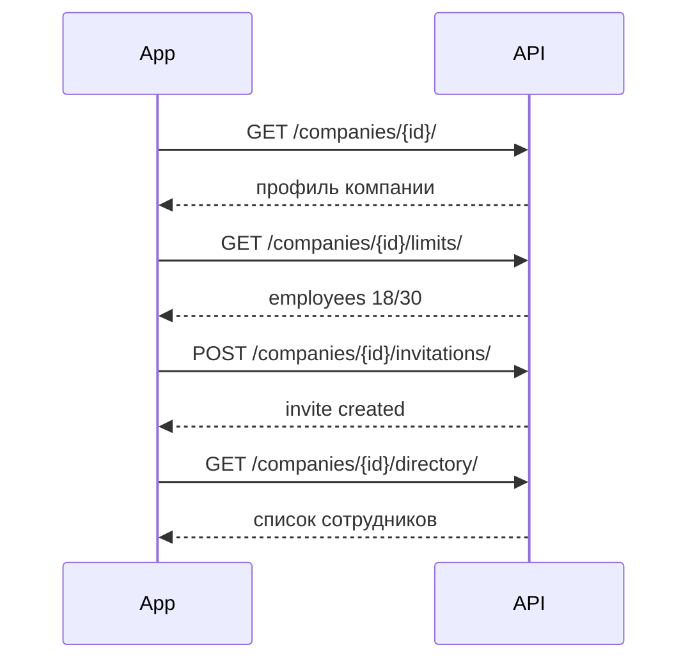

# Companies — Компании и приглашения

> Базовый префикс: `/api/v1/companies/`  
> Подключение: [← Основная документация](mobile_api.md)

Управление компаниями, участниками, приглашениями, справочником сотрудников и календарём компании.

---

## Компании (CRUD)

### ✅ GET /api/v1/companies/

> Список компаний. `superadmin` видит все; `company_admin` / `employee` — только свою компанию.

🔒 Требует авторизации · `IsCompanyMember` (guest → 403)

**Request**

```http
GET /api/v1/companies/?plan=premium&is_active=true&search=Астана&ordering=-created_at&page=1&page_size=20
Authorization: Bearer <access_token>
```

| Параметр | Описание |
|----------|----------|
| `plan` | `basic`, `standard`, `premium` |
| `is_active` | `true` / `false` |
| `search` | Поиск по `name` |
| `ordering` | `name`, `-name`, `created_at`, `-created_at`, `plan`, `-plan` |
| `page`, `page_size` | Пагинация DRF (по умолчанию 20, макс. 100) |

**Response 200**

```json
{
  "count": 1,
  "next": null,
  "previous": null,
  "results": [
    {
      "id": 5,
      "name": "ТОО Астана Бизнес",
      "description": "IT-компания",
      "logo": "https://your-domain.com/media/company_logos/logo.png",
      "floor": "3",
      "office_number": "301",
      "company_admin": {
        "id": 10,
        "email": "admin@astana-biz.kz",
        "first_name": "Айгуль",
        "last_name": "Серикова",
        "full_name": "Айгуль Серикова",
        "avatar": null,
        "position": "CEO"
      },
      "categories": ["IT", "B2B"],
      "plan": "standard",
      "max_employees": 30,
      "storage_limit_gb": "20.000",
      "max_boards": 5,
      "is_active": true,
      "working_hours_start": "09:00:00",
      "working_hours_end": "18:00:00",
      "employee_count": 18,
      "floor_id": 3,
      "floor_number": 3,
      "floor_name": "Этаж 3",
      "created_at": "2024-01-10T08:00:00Z",
      "updated_at": "2024-06-01T12:00:00Z"
    }
  ]
}
```

---

### ✅ POST /api/v1/companies/

> Создать компанию. Лимиты подставляются из тарифа, если не переданы явно.

🔒 Требует авторизации · только `superadmin`

**Request**

```http
POST /api/v1/companies/
Authorization: Bearer <access_token>
Content-Type: multipart/form-data
```

```
name=ТОО Новая Компания
description=Описание компании
plan=standard
categories=["IT","SaaS"]
floor_id=3
logo=<binary file>
```

| Поле | Обязательно | Описание |
|------|-------------|----------|
| `name` | да | Название |
| `description` | нет | Описание |
| `logo` | нет | Логотип (изображение) |
| `floor` | нет | Этаж (строка, legacy) |
| `floor_id` | нет | ID этажа из Services API |
| `office_number` | нет | Номер офиса |
| `categories` | нет | JSON-массив строк (макс. 10, каждая до 50 символов) |
| `plan` | нет | `basic` (по умолчанию), `standard`, `premium` |
| `max_employees`, `storage_limit_gb`, `max_boards` | нет | Переопределение лимитов тарифа |

**Response 201** — объект `CompanyDetailSerializer` (см. GET detail ниже).

---

### ✅ GET /api/v1/companies/{id}/

> Детальная карточка компании.

🔒 Требует авторизации · `IsCompanyMember`

**Response 200**

```json
{
  "id": 5,
  "name": "ТОО Астана Бизнес",
  "description": "IT-компания",
  "logo": "https://your-domain.com/media/company_logos/logo.png",
  "floor": "3",
  "office_number": "301",
  "company_admin": {
    "id": 10,
    "email": "admin@astana-biz.kz",
    "full_name": "Айгуль Серикова",
    "avatar": null,
    "position": "CEO"
  },
  "categories": ["IT", "B2B"],
  "plan": "standard",
  "max_employees": 30,
  "storage_limit_gb": "20.000",
  "max_boards": 5,
  "is_active": true,
  "working_hours_start": "09:00:00",
  "working_hours_end": "18:00:00",
  "employee_count": 18,
  "storage_used": 1073741824,
  "onboarding_completed": true,
  "floor_id": 3,
  "floor_number": 3,
  "floor_name": "Этаж 3",
  "created_at": "2024-01-10T08:00:00Z",
  "updated_at": "2024-06-01T12:00:00Z"
}
```

| Поле | Описание |
|------|----------|
| `storage_used` | Использованное хранилище в байтах |
| `onboarding_completed` | Из `CompanySettings` |

**Ошибки**

| Код | Когда | Что делать мобильщику |
|-----|-------|----------------------|
| 403 | Guest или чужая компания | Скрыть раздел |
| 404 | Компания не найдена | Экран ошибки |

---

### ✅ PATCH /api/v1/companies/{id}/

> Частичное обновление компании. Набор полей зависит от роли.

🔒 Требует авторизации · `company_admin` или `superadmin`

**Request (company_admin — только разрешённые поля)**

```http
PATCH /api/v1/companies/5/
Authorization: Bearer <access_token>
Content-Type: multipart/form-data
```

```
name=ТОО Астана Бизнес
description=Обновлённое описание
categories=["IT","FinTech"]
floor_id=4
```

| Роль | Редактируемые поля |
|------|-------------------|
| `company_admin` | `name`, `description`, `categories`, `floor_id`, `logo` (только `plan=premium`) |
| `superadmin` | Все поля компании + `plan`, лимиты |

**Response 200** — `CompanyDetailSerializer`.

**Ошибки**

| Код | Когда | Что делать мобильщику |
|-----|-------|----------------------|
| 403 | `company_admin` загружает `logo` на non-premium тарифе | Показать upsell premium |
| 403 | `employee` пытается редактировать | Скрыть действие |

---

### ✅ DELETE /api/v1/companies/{id}/

> Жёсткое удаление компании.

🔒 Требует авторизации · только `superadmin`

**Request**

```http
DELETE /api/v1/companies/5/?confirm=true
Authorization: Bearer <access_token>
```

**Response 204** — тело пустое.

**Ошибки**

| Код | Когда | Что делать мобильщику |
|-----|-------|----------------------|
| 400 | `confirm=true` не передан | Запросить подтверждение у пользователя |

---

## Настройки и лимиты

### ✅ GET /api/v1/companies/{id}/settings/

### ✅ PATCH /api/v1/companies/{id}/settings/

> Настройки компании (брендинг, HR, рабочие часы).

🔒 `GET` — `IsCompanyMember` · `PATCH` — `company_admin` (своя компания) или `superadmin`

**Response 200 (GET)**

```json
{
  "custom_task_categories": ["Баг", "Фича"],
  "custom_labels": [
    { "name": "Срочно", "color": "#FF5733" }
  ],
  "vacation_days_per_year": 24,
  "onboarding_enabled": true,
  "brand_primary_color": "#1A73E8",
  "working_hours": {
    "start": "09:00",
    "end": "18:00"
  }
}
```

**Request (PATCH)**

```json
{
  "vacation_days_per_year": 28,
  "brand_primary_color": "#1A73E8",
  "working_hours": {
    "start": "08:30",
    "end": "17:30"
  },
  "custom_task_categories": ["Баг", "Фича", "Документация"]
}
```

**Ошибки**

| Код | Когда | Что делать мобильщику |
|-----|-------|----------------------|
| 403 | `employee` пытается PATCH | Только просмотр |
| 403 | `brand_primary_color` на non-premium (не superadmin) | Upsell premium |

---

### ✅ GET /api/v1/companies/{id}/limits/

> Текущее использование лимитов тарифа.

🔒 Требует авторизации · `IsCompanyMember`

**Response 200**

```json
{
  "employees": { "current": 18, "max": 30 },
  "boards": { "current": 3, "max": 5 },
  "storage": {
    "used_gb": 1.2345,
    "used_bytes": 1325423456,
    "limit_gb": "20.000"
  }
}
```

---

## Участники компании

### ✅ GET /api/v1/companies/{id}/members/

> Список участников компании (без `superadmin`).

🔒 Требует авторизации · `IsCompanyMember` (только своя компания для admin/employee)

**Request**

```http
GET /api/v1/companies/5/members/?role=employee&is_active=true&search=ivan&ordering=-date_joined
Authorization: Bearer <access_token>
```

**Response 200** — пагинированный список:

```json
{
  "count": 18,
  "next": null,
  "previous": null,
  "results": [
    {
      "id": 42,
      "email": "ivan.petrov@example.com",
      "full_name": "Иван Петров",
      "role": "employee",
      "position": "Разработчик",
      "avatar": "/media/avatars/42/photo.jpg",
      "is_active": true,
      "is_email_verified": true,
      "date_joined": "2024-02-01T10:00:00Z",
      "last_login": "2024-06-14T16:00:00Z"
    }
  ]
}
```

---

### ✅ POST /api/v1/companies/{id}/members/{user_id}/deactivate/

> Деактивировать участника (`is_active: false`), инвалидировать его сессии.

🔒 `company_admin` или `superadmin`

**Response 200**

```json
{
  "detail": "Пользователь деактивирован"
}
```

---

### ✅ POST /api/v1/companies/{id}/members/{user_id}/activate/

> Активировать участника.

🔒 `company_admin` или `superadmin`

**Response 200**

```json
{
  "detail": "Пользователь активирован"
}
```

---

### ✅ DELETE /api/v1/companies/{id}/members/{user_id}/

> Удалить из компании: сбрасывает `company`, `role → guest`, `is_active → false`, инвалидирует сессии.

🔒 `company_admin` или `superadmin`

**Request**

```http
DELETE /api/v1/companies/5/members/42/?reassign_to=55
Authorization: Bearer <access_token>
```

| Параметр | Описание |
|----------|----------|
| `reassign_to` | ID активного участника для переназначения задач (опционально) |

**Response 200**

```json
{
  "detail": "Пользователь удалён из компании",
  "tasks_reassigned": 7
}
```

**Ошибки**

| Код | Когда | Что делать мобильщику |
|-----|-------|----------------------|
| 400 | Удаление себя / `company_admin` без superadmin | Показать причину |
| 400 | Невалидный `reassign_to` | Выбрать другого участника |

---

### ✅ PATCH /api/v1/companies/{id}/members/{user_id}/role/

> Сменить роль участника (`company_admin` ↔ `employee`).

🔒 `company_admin` или `superadmin`

**Request**

```json
{
  "role": "company_admin"
}
```

**Response 200**

```json
{
  "detail": "Роль изменена"
}
```

**Ошибки**

| Код | Когда | Что делать мобильщику |
|-----|-------|----------------------|
| 400 | Смена своей роли / понижение последнего admin | Показать ограничение |

---

### ✅ GET /api/v1/companies/{company_id}/members/{user_id}/activity/

> Сводка активности участника для карточки в админке команды.

🔒 `company_admin` (своя компания) или `superadmin`

**Response 200**

```json
{
  "last_login": "2024-06-14T16:45:00Z",
  "active_tasks_count": 5,
  "completed_tasks_count": 12,
  "bookings_last_30_days": 8
}
```

---

## Справочник сотрудников (Directory)

### ✅ GET /api/v1/companies/{company_id}/directory/

> Карточки команды для экрана «Сотрудники».

🔒 Требует авторизации · `IsCompanyMember`

**Request**

```http
GET /api/v1/companies/5/directory/?search=иван&position=разработчик&role=employee&ordering=full_name
Authorization: Bearer <access_token>
```

**Response 200** — пагинированный список:

```json
{
  "count": 12,
  "results": [
    {
      "id": 42,
      "avatar": "/media/avatars/42/photo.jpg",
      "full_name": "Иван Петров",
      "position": "Разработчик",
      "email": "ivan.petrov@example.com",
      "phone": "+77001234567",
      "role": "employee",
      "is_active": true,
      "last_login": "2024-06-14T16:00:00Z"
    }
  ]
}
```

---

### ✅ GET /api/v1/companies/{company_id}/directory/{user_id}/

> Профиль сотрудника в справочнике.

🔒 Требует авторизации · `IsCompanyMember`

**Response 200**

```json
{
  "id": 42,
  "avatar": "/media/avatars/42/photo.jpg",
  "full_name": "Иван Петров",
  "position": "Разработчик",
  "email": "ivan.petrov@example.com",
  "phone": "+77001234567",
  "role": "employee",
  "is_active": true,
  "last_login": "2024-06-14T16:00:00Z",
  "tasks_count": 7,
  "bookings_last_30_days": 4
}
```

| Поле | Примечание |
|------|-----------|
| `bookings_last_30_days` | Будущие бронирования на 30 дней вперёд (не прошлые) |

---

## Приглашения

### ✅ GET /api/v1/companies/{company_id}/invitations/

### ✅ POST /api/v1/companies/{company_id}/invitations/

> Список и создание приглашений в компанию.

🔒 `company_admin` или `superadmin`

**Request (POST)**

```json
{
  "email": "new.employee@example.com",
  "role": "employee"
}
```

| Поле | Описание |
|------|----------|
| `email` | Email приглашённого |
| `role` | `employee` или `company_admin` (admin — только superadmin) |

**Response 201**

```json
{
  "id": 15,
  "email": "new.employee@example.com",
  "role": "employee",
  "token": "3fa85f64-5717-4562-b3fc-2c963f66afa6",
  "invited_by_name": "Айгуль Серикова",
  "is_used": false,
  "is_expired": false,
  "is_valid": true,
  "expires_at": "2024-06-18T10:00:00Z",
  "created_at": "2024-06-15T10:00:00Z"
}
```

Срок действия приглашения по умолчанию — **72 часа**.

**Ошибки**

| Код | Когда | Что делать мобильщику |
|-----|-------|----------------------|
| 400 | Лимит сотрудников / email уже приглашён / email занят | Показать причину |

---

### ✅ POST /api/v1/companies/{company_id}/invitations/{id}/revoke/

> Отозвать приглашение (помечает как использованное).

🔒 `company_admin` или `superadmin`

**Response 200**

```json
{
  "detail": "Приглашение отозвано"
}
```

---

### ✅ POST /api/v1/companies/{company_id}/invitations/{id}/resend/

> Переотправить приглашение: старое инвалидируется, создаётся новое с новым токеном.

🔒 `company_admin` или `superadmin`

**Response 200**

```json
{
  "detail": "Приглашение отправлено повторно"
}
```

---

## Онбординг компании

### ✅ GET /api/v1/companies/{id}/onboarding-status/

> Статус шагов онбординга. При выполнении всех шагов автоматически ставит `completed: true`.

🔒 `company_admin` (своя компания) или `superadmin`

**Response 200**

```json
{
  "completed": false,
  "steps": [
    { "key": "upload_logo", "title": "Upload company logo", "completed": true },
    { "key": "fill_description", "title": "Fill company description", "completed": false },
    { "key": "create_first_board", "title": "Create first board", "completed": false },
    { "key": "invite_first_employee", "title": "Invite first employee", "completed": false }
  ]
}
```

---

### ✅ POST /api/v1/companies/{id}/onboarding-status/skip/

> Пропустить онбординг (принудительно `completed: true`).

🔒 `company_admin` или `superadmin`

**Response 200**

```json
{
  "completed": true
}
```

---

## Календарь компании

### ✅ GET /api/v1/companies/{company_id}/calendar/

> Агрегированные события компании: бронирования, дедлайны задач, отпуска, визиты гостей.

🔒 Требует авторизации · `IsCompanyMember`

**Request**

```http
GET /api/v1/companies/5/calendar/?date_from=2024-06-01&date_to=2024-06-30&event_type=booking&user_id=42&my=true
Authorization: Bearer <access_token>
```

| Параметр | Обязательно | Описание |
|----------|-------------|----------|
| `date_from` | да | `YYYY-MM-DD` |
| `date_to` | да | `YYYY-MM-DD` |
| `event_type` | нет | `booking`, `task_deadline`, `leave`, `guest_visit` |
| `user_id` | нет | Фильтр по участнику (admin/superadmin) |
| `my` | нет | `true` — только события текущего пользователя |

**Response 200** — массив (без пагинации):

```json
[
  {
    "type": "booking",
    "title": "Переговорная A-201",
    "start": "2024-06-15T09:00:00+06:00",
    "end": "2024-06-15T10:00:00+06:00",
    "user": { "id": 42, "full_name": "Иван Петров" }
  },
  {
    "type": "task_deadline",
    "title": "Сдать отчёт",
    "start": "2024-06-20T17:00:00+06:00",
    "end": "2024-06-20T17:00:00+06:00",
    "user": { "id": 42, "full_name": "Иван Петров" },
    "task_id": 55,
    "board_id": 3
  },
  {
    "type": "leave",
    "title": "Айгуль Серикова — vacation",
    "start": "2024-06-10T00:00:00+06:00",
    "end": "2024-06-14T23:59:59.999999+06:00",
    "user": { "id": 10, "full_name": "Айгуль Серикова" }
  },
  {
    "type": "guest_visit",
    "title": "Асхат Нурланов",
    "start": "2024-06-15T08:00:00+06:00",
    "end": "2024-06-15T20:00:00+06:00",
    "user": { "id": 42, "full_name": "Иван Петров" },
    "guest_pass_id": 12
  }
]
```

---

### ✅ GET /api/v1/companies/{company_id}/calendar/busy/

> Занятые слоты пользователя за один день (для UI выбора времени).

🔒 Требует авторизации · `IsCompanyMember`

**Request**

```http
GET /api/v1/companies/5/calendar/busy/?user_id=42&date=2024-06-15
Authorization: Bearer <access_token>
```

| Параметр | Обязательно | Описание |
|----------|-------------|----------|
| `user_id` | да | ID участника компании |
| `date` | да | `YYYY-MM-DD` |

**Response 200**

```json
[
  {
    "start": "2024-06-15T09:00:00+06:00",
    "end": "2024-06-15T10:00:00+06:00",
    "type": "booking"
  }
]
```

> `employee` всегда видит только свой `user_id` (параметр игнорируется).

---

## Superadmin: lifecycle и bulk

### ✅ POST /api/v1/companies/{id}/deactivate/

> Деактивировать компанию и всех её участников, отменить подтверждённые бронирования.

🔒 только `superadmin`

**Response 200** — `CompanySerializer`.

---

### ✅ POST /api/v1/companies/{id}/activate/

> Активировать компанию и всех участников.

🔒 только `superadmin`

---

### ✅ POST /api/v1/companies/bulk-activate/

### ✅ POST /api/v1/companies/bulk-deactivate/

### ✅ DELETE /api/v1/companies/bulk-delete/

> Массовые операции над компаниями.

🔒 только `superadmin`

**Request**

```json
{
  "ids": [5, 7, 12]
}
```

**Response 200**

```json
{ "activated": 2 }
```

```json
{ "deactivated": 1 }
```

```json
{ "deleted": 3 }
```

> `bulk-delete` — soft delete (`is_deleted: true`).

---

## Superadmin: building staff

### ✅ GET /api/v1/companies/building-staff/

> Список пользователей здания (`reception`, `service_manager`).

🔒 только `superadmin`

**Request**

```http
GET /api/v1/companies/building-staff/?role=reception&search=recep&is_active=true
```

**Response 200** — пагинированный `CompanyMemberSerializer`.

---

### ✅ GET /api/v1/companies/building-invites/

### ✅ POST /api/v1/companies/building-invites/

> Приглашения для ролей здания без привязки к компании.

🔒 только `superadmin`

**Request (POST)**

```json
{
  "email": "reception@example.com",
  "role": "reception"
}
```

| `role` | `reception` или `service_manager` |

Регистрация по ссылке — `POST /api/v1/auth/register/invite/` (см. [Auth](mobile_api.md)).

---

### ✅ POST /api/v1/companies/building-invites/{id}/revoke/

### ✅ POST /api/v1/companies/building-invites/{id}/resend/

> Аналогично company invitations.

🔒 только `superadmin`

---

### Важные детали для мобильщиков (Companies)

#### Доступ по ролям

| Эндпоинт | employee | company_admin | superadmin | guest |
|----------|----------|---------------|------------|-------|
| Список / деталь своей компании | ✅ | ✅ | ✅ все | ❌ 403 |
| PATCH компании | ❌ | ✅ (ограничено) | ✅ | ❌ |
| Settings GET | ✅ | ✅ | ✅ | ❌ |
| Settings PATCH | ❌ | ✅ | ✅ | ❌ |
| Members / Directory | ✅ своя | ✅ своя | ✅ | ❌ |
| Member actions | ❌ | ✅ | ✅ | ❌ |
| Invitations | ❌ | ✅ | ✅ | ❌ |
| Calendar | ✅ своя | ✅ своя | ✅ | ❌ |
| Admin lifecycle / bulk / building | ❌ | ❌ | ✅ | ❌ |

Сотрудник или admin **без `company_id`** получает `403` с кодом `company_not_assigned` — покажите экран онбординга.

#### Тарифы и premium-gating

| Тариф | `max_employees` | `max_boards` | `storage_limit_gb` |
|-------|-----------------|--------------|-------------------|
| `basic` | 10 | 1 | 5 |
| `standard` | 30 | 5 | 20 |
| `premium` | 9999 | 9999 | 100 |

Premium-only для `company_admin`:
- загрузка `logo` (`PATCH /companies/{id}/`)
- `brand_primary_color` в settings

Перед приглашением проверяйте `GET /companies/{id}/limits/` — `employees.current >= employees.max` вернёт 400 при POST invitation.

#### Multipart и `categories`

Создание/обновление компании с логотипом — `multipart/form-data`.  
Поле `categories` в multipart передавайте как JSON-строку: `categories=["IT","SaaS"]`, не как отдельные поля.

#### Приглашения → регистрация

1. Admin создаёт invite → email с ссылкой.
2. Мобильное приложение: `GET /auth/register/invite/?token=...` — предзаполнение.
3. `POST /auth/register/invite/` — завершение (токены **не выдаются**).
4. Пользователь подтверждает email и логинится.

Токен приглашения живёт **72 часа**. Resend создаёт **новый** токен.

#### Календарь vs Core calendar

| API | Содержимое | Кто |
|-----|-----------|-----|
| `GET /calendar/events/` (Core) | Только одобренные отпуска | Company members |
| `GET /companies/{id}/calendar/` | Bookings + tasks + leaves + guest visits | Company members |

Для полноценного календаря компании используйте **Companies calendar**.  
`employee` не может смотреть чужой календарь — только `my=true` или свой `user_id` игнорируется в пользу self.

#### Аватары в members/directory

`avatar` в members и directory — **относительный путь**. Собирайте полный URL на клиенте или используйте `company_admin.avatar` из detail (там absolute URI при наличии request context).

#### Удаление участника

`DELETE .../members/{id}/` не удаляет аккаунт — переводит в `guest` без компании. Все refresh-сессии инвалидируются. Опционально передайте `reassign_to` для CRM-задач.

#### Рекомендуемый flow (company_admin)



---
