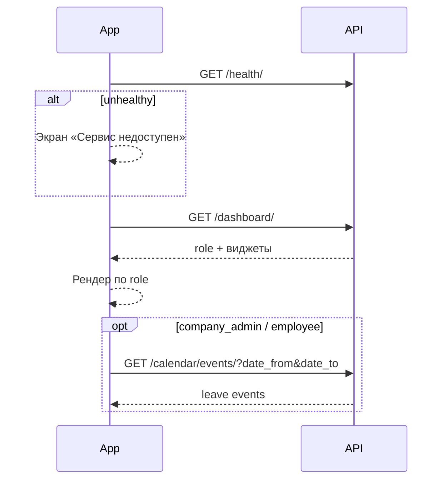

# Core — Health, ping, dashboard, calendar

> Базовый префикс: `/api/v1/`  
> Подключение: [← Основная документация](mobile_api.md)

Системные эндпоинты и агрегированные данные для главного экрана и календаря команды.

---

### ✅ GET /api/v1/health/

> Проверка доступности API и подключения к базе данных. Используется для мониторинга и pre-flight проверки перед запуском приложения.

🔓 Публичный

**Request**

```http
GET /api/v1/health/
```

**Response 200** (сервис здоров)

```json
{
  "status": "healthy",
  "database": "connected",
  "deployment_marker": "pipeline-verify-2026-04-06",
  "environment": "alpha-test"
}
```

**Response 503** (БД недоступна)

```json
{
  "status": "unhealthy",
  "database": "unavailable",
  "deployment_marker": "pipeline-verify-2026-04-06",
  "environment": "alpha-test"
}
```

**Ошибки**

| Код | Когда | Что делать мобильщику |
|-----|-------|----------------------|
| 503 | База данных недоступна | Показать экран «Сервис временно недоступен», повторить позже |

---

### ✅ GET /api/v1/ping/

> Минимальная проверка, что API отвечает.

🔓 Публичный

**Request**

```http
GET /api/v1/ping/
```

**Response 200**

```json
{
  "message": "pong",
  "version": "beta-test"
}
```

---

### ✅ GET /api/v1/calendar/events/

> События командного календаря: одобренные заявки на отсутствие сотрудников компании.

🔒 Требует авторизации · роли `superadmin`, `company_admin`, `employee` (с привязкой к компании)

**Request**

```http
GET /api/v1/calendar/events/?date_from=2024-06-01&date_to=2024-06-30
Authorization: Bearer <access_token>
```

| Параметр | Обязательно | Описание |
|----------|-------------|----------|
| `date_from` | нет | Начало диапазона (`YYYY-MM-DD`). Оставляет события, у которых `end_date >= date_from` |
| `date_to` | нет | Конец диапазона (`YYYY-MM-DD`). Оставляет события, у которых `start_date <= date_to` |

**Response 200** — массив событий (без пагинации)

```json
[
  {
    "id": "leave-15",
    "event_type": "leave",
    "source_id": 15,
    "title": "Отсутствие: Айгуль Серикова",
    "start": "2024-06-10",
    "end": "2024-06-14",
    "all_day": true,
    "status": "approved",
    "user_id": 42,
    "user_name": "Айгуль Серикова",
    "leave_type": "vacation",
    "comment": "Семейный отпуск"
  }
]
```

| Поле | Значения |
|------|----------|
| `event_type` | Сейчас только `leave` |
| `leave_type` | `vacation`, `day_off`, `sick_leave`, `remote` |
| `status` | В выборке всегда `approved` (другие статусы не попадают) |
| `start`, `end` | Даты в формате `YYYY-MM-DD` |

**Ошибки**

| Код | Когда | Что делать мобильщику |
|-----|-------|----------------------|
| 400 | Невалидный формат `date_from` / `date_to` | Показать ошибку формата даты |
| 401 | Не авторизован | Обновить токен или войти заново |
| 403 | Роль `guest`, `reception`, `service_manager` или сотрудник без компании | Скрыть календарь команды |

---

### ✅ GET /api/v1/dashboard/

> Главный экран приложения: набор виджетов зависит от роли текущего пользователя. Один эндпоинт — разные поля в ответе.

🔒 Требует авторизации

**Request**

```http
GET /api/v1/dashboard/
Authorization: Bearer <access_token>
```

**Общие поля (все роли)**

```json
{
  "role": "employee",
  "user": {
    "id": 42,
    "full_name": "Иван Петров",
    "avatar": "/media/avatars/42/photo.jpg"
  }
}
```

> `user.avatar` — относительный URL или `null`. Для абсолютного URL используйте `GET /auth/me/`.

---

#### Ответ для `superadmin`

```json
{
  "role": "superadmin",
  "user": { "id": 1, "full_name": "Супер Админ", "avatar": null },
  "total_companies": 24,
  "total_users": 318,
  "bookings_today": 47,
  "bookings_week_delta": 5,
  "space_load_pct": 62,
  "open_service_requests": 8,
  "service_requests_closed_today": 3,
  "new_companies_last_7d": 2,
  "recent_events": [
    {
      "event_type": "booking",
      "id": 101,
      "title": "Переговорная A-201 — Иван Петров",
      "start_time": "2024-06-15T09:00:00Z",
      "status": "confirmed"
    }
  ],
  "quick_actions": [
    "invite_user",
    "create_announcement",
    "manage_bookings",
    "view_analytics",
    "manage_companies"
  ],
  "bookings_recent": [
    {
      "id": 101,
      "resource_name": "Переговорная A-201",
      "user_name": "Иван Петров",
      "company_name": "ТОО Астана Бизнес",
      "start_time": "2024-06-15T09:00:00Z",
      "end_time": "2024-06-15T10:00:00Z",
      "status": "confirmed"
    }
  ],
  "announcements_recent": [
    {
      "id": 7,
      "title": "Плановое отключение лифтов",
      "text": "Завтра с 10:00 до 12:00...",
      "created_at": "2024-06-14T08:00:00Z"
    }
  ],
  "floor_load": [
    {
      "floor_id": 3,
      "floor_number": 3,
      "floor_name": "Этаж 3",
      "total": 40,
      "occupied": 28,
      "occupancy_pct": 70
    }
  ]
}
```

| Поле | Лимит / примечание |
|------|-------------------|
| `recent_events` | До 10 последних бронирований (все компании) |
| `bookings_recent` | До 5 бронирований на сегодня |
| `announcements_recent` | До 3 объявлений БЦ (`company: null`) |
| `floor_load` | Загрузка всех этажей |

---

#### Ответ для `company_admin`

```json
{
  "role": "company_admin",
  "user": { "id": 5, "full_name": "Айгуль Серикова", "avatar": null },
  "employee_count": 18,
  "active_tasks": 34,
  "bookings_today": 6,
  "free_resources_now": 12,
  "announcement_feed": [
    {
      "id": 12,
      "title": "Собрание отдела",
      "body": "Пятница в 15:00",
      "category": "event",
      "scope": "company",
      "created_at": "2024-06-14T10:00:00Z"
    }
  ],
  "pending_approvals": {
    "leaves": [
      {
        "id": 8,
        "employee": { "id": 42, "full_name": "Иван Петров", "avatar": null },
        "leave_type": "vacation",
        "start_date": "2024-06-20",
        "end_date": "2024-06-27",
        "created_at": "2024-06-14T09:00:00Z"
      }
    ],
    "guest_passes": [
      {
        "id": 3,
        "guest_name": "Асхат Нурланов",
        "guest_email": "askhat@example.com",
        "host": { "id": 5, "full_name": "Айгуль Серикова", "avatar": null },
        "visit_date": "2024-06-15T08:00:00Z",
        "valid_from": "2024-06-15T08:00:00Z",
        "valid_until": "2024-06-15T20:00:00Z",
        "created_at": "2024-06-14T16:00:00Z"
      }
    ]
  },
  "bookings_recent": [],
  "team_bookings_today": [
    {
      "user_full_name": "Иван Петров",
      "user_initials": "ИП",
      "resource_name": "Стол B-14",
      "start_time": "2024-06-15T09:00:00Z",
      "end_time": "2024-06-15T18:00:00Z",
      "status": "confirmed"
    }
  ],
  "my_tasks": [
    {
      "id": 55,
      "title": "Согласовать бюджет",
      "board_name": "Финансы",
      "due_date": "2024-06-15",
      "priority": "high",
      "is_overdue": false
    }
  ]
}
```

| Поле | Лимит / примечание |
|------|-------------------|
| `announcement_feed` | До 5: объявления компании + БЦ |
| `pending_approvals.leaves` | Заявки со статусом `pending` |
| `pending_approvals.guest_passes` | Активные пропуска (`status: active`) |
| `team_bookings_today` | До 10 бронирований команды на сегодня |
| `my_tasks` | До 5 задач с дедлайном сегодня или без дедлайна (просроченные исключены) |

---

#### Ответ для `employee`

```json
{
  "role": "employee",
  "user": { "id": 42, "full_name": "Иван Петров", "avatar": null },
  "my_tasks_today": 2,
  "my_bookings_today": 1,
  "unread_notifications_count": 4,
  "announcement_feed": [
    {
      "id": 12,
      "title": "Собрание отдела",
      "body": "Пятница в 15:00",
      "category": "event",
      "scope": "company",
      "created_at": "2024-06-14T10:00:00Z"
    }
  ],
  "bookings_recent": [],
  "my_upcoming_bookings": [
    {
      "id": 101,
      "resource_name": "Переговорная A-201",
      "resource_type": "meeting_room",
      "resource_capacity": 8,
      "resource_row": null,
      "start_time": "2024-06-15T14:00:00Z",
      "end_time": "2024-06-15T15:00:00Z",
      "is_all_day": false,
      "status": "confirmed"
    }
  ],
  "my_tasks": [
    {
      "id": 55,
      "title": "Подготовить отчёт",
      "board_name": "Маркетинг",
      "due_date": "2024-06-15",
      "priority": "medium",
      "is_overdue": false
    }
  ],
  "my_tasks_boards_count": 2
}
```

| Поле | Примечание |
|------|-----------|
| `my_tasks_today` | Задачи с дедлайном **сегодня** (локальная дата сервера) |
| `my_bookings_today` | Подтверждённые бронирования пользователя на сегодня |
| `my_upcoming_bookings` | До 5 ближайших на сегодня |
| `my_tasks_boards_count` | Число уникальных досок в `my_tasks` |

---

#### Ответ для `guest`, `reception`, `service_manager`

```json
{
  "role": "guest",
  "user": { "id": 99, "full_name": "Гость Тестов", "avatar": null },
  "my_bookings_today": 1,
  "quick_booking": {
    "available_desks": 45,
    "available_rooms": 12
  },
  "bc_announcements": [
    {
      "id": 7,
      "title": "Добро пожаловать в New Level Hub",
      "body": "Инструкция для гостей...",
      "category": "info",
      "scope": "building",
      "created_at": "2024-06-01T08:00:00Z"
    }
  ]
}
```

| Поле | Примечание |
|------|-----------|
| `quick_booking.available_desks` | Число активных ресурсов типа `desk` (глобально) |
| `quick_booking.available_rooms` | Число активных ресурсов типа `meeting_room` |
| `bc_announcements` | До 5 объявлений БЦ (`scope: building`) |

**Ошибки**

| Код | Когда | Что делать мобильщику |
|-----|-------|----------------------|
| 401 | Не авторизован | Обновить токен или войти заново |

---

### Важные детали для мобильщиков (Core)

#### Когда вызывать

| Эндпоинт | Сценарий |
|----------|----------|
| `/health/` | Splash screen, фоновый health-check, CI/CD |
| `/ping/` | Быстрая проверка сети (легче, чем `/health/`) |
| `/dashboard/` | Главный экран после login — **один запрос** вместо нескольких |
| `/calendar/events/` | Экран командного календаря отсутствий (HR) |

#### Dashboard — рендеринг по роли

Парсите поле `role` в ответе и показывайте только релевантные виджеты:

| `role` | Ключевые виджеты |
|--------|-----------------|
| `superadmin` | KPI платформы, `floor_load`, `quick_actions` |
| `company_admin` | `pending_approvals`, `team_bookings_today`, `employee_count` |
| `employee` | `my_tasks`, `my_upcoming_bookings`, `unread_notifications_count` |
| `guest` / `reception` / `service_manager` | `quick_booking`, `bc_announcements` |

`reception` и `service_manager` получают **тот же набор**, что и `guest` (ветка `else` в коде).

#### Часовой пояс

«Сегодня» на сервере считается в часовом поясе **Asia/Almaty**. Все границы дня (`bookings_today`, `my_bookings_today` и т.д.) привязаны к локальной дате сервера, не к UTC на устройстве.

#### Календарь

- Только **одобренные** отпуска (`status: approved`).
- `superadmin` видит отпуска всех компаний; `company_admin` / `employee` — только своей компании.
- Ответ — **плоский массив**, не объект с `results`. Пагинации нет.
- Для деталей заявки переходите в HR API (`/api/v1/hr/...`).

#### Аватары в dashboard

`user.avatar` и вложенные `employee.avatar` / `host.avatar` — **относительные пути** (`/media/...`). Собирайте полный URL: `https://your-domain.com` + путь, либо берите аватар из `GET /auth/me/`.

#### Кэширование

- `/dashboard/` — агрегирует данные из bookings, CRM, HR, notifications. Рекомендуется pull-to-refresh, TTL кэша 1–2 минуты.
- `/health/` и `/ping/` — можно кэшировать на 30 сек для offline-индикатора.

#### `quick_actions` (superadmin)

Строковые идентификаторы для навигации в admin-разделах приложения:

- `invite_user` → Companies / Invitations
- `create_announcement` → Services / Announcements
- `manage_bookings` → Bookings
- `view_analytics` → Analytics
- `manage_companies` → Companies

#### Рекомендуемый flow главного экрана



---
