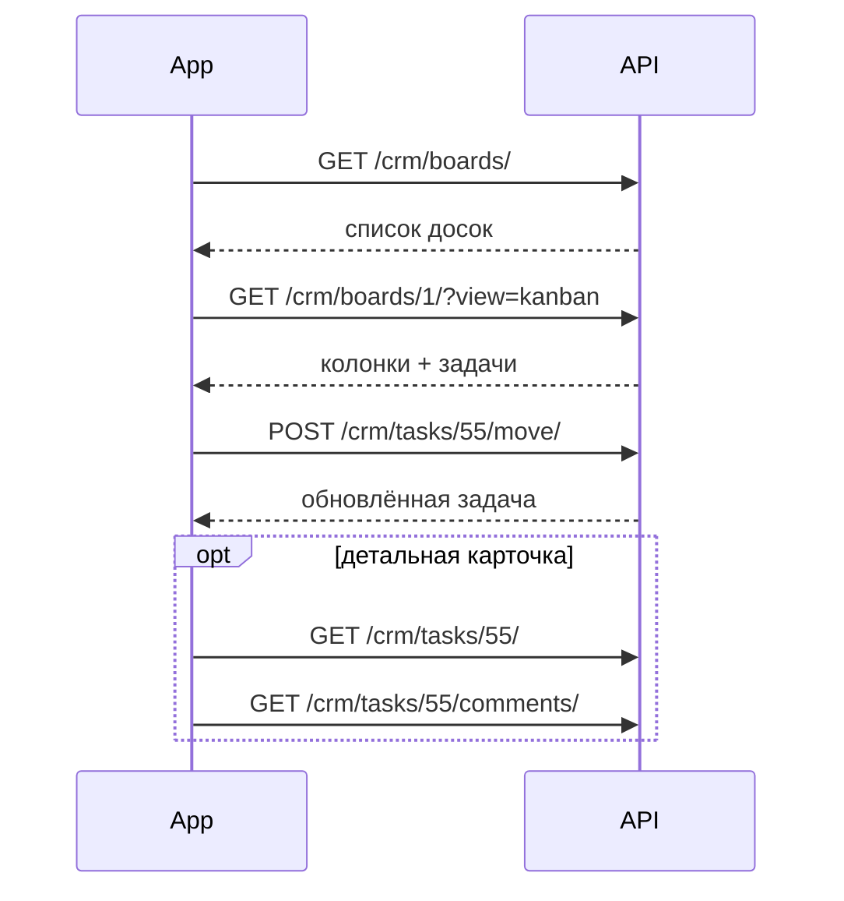

# CRM — Задачи и доски

> Базовый префикс: `/api/v1/crm/`  
> Подключение: [← Основная документация](mobile_api.md)

Kanban-доски, задачи, метки, комментарии, чеклисты и вложения.

---

## Шаблоны досок

### ✅ GET /api/v1/crm/board-templates/

> Список шаблонов для создания доски (колонки создаются автоматически).

🔒 `company_admin`, `employee`, `superadmin` (без требования подтверждения email)

**Response 200**

```json
[
  {
    "id": "basic",
    "name": "Базовая",
    "columns": ["К выполнению", "В работе", "Готово"]
  },
  {
    "id": "sales",
    "name": "Продажи",
    "columns": ["Лиды", "Переговоры", "Сделка", "Закрыто"]
  }
]
```

| `id` | Описание |
|------|----------|
| `basic` | 3 колонки (по умолчанию) |
| `sales` | 4 колонки воронки продаж |
| `recruitment` | 5 колонок HR |
| `project` | 4 колонки проекта |

---

## Доски (Boards)

### ✅ GET /api/v1/crm/boards/

> Список досок компании. Архивные скрыты по умолчанию.

🔒 `IsCompanyMember` + подтверждённый email

**Request**

```http
GET /api/v1/crm/boards/?include_archived=false&company_id=5
Authorization: Bearer <access_token>
```

| Параметр | Описание |
|----------|----------|
| `include_archived` | `true` — включить архивные доски |
| `company_id` | Только `superadmin` |

**Response 200** — пагинированный список:

```json
{
  "count": 3,
  "results": [
    {
      "id": 1,
      "name": "Маркетинг",
      "description": "Задачи отдела маркетинга",
      "is_archived": false,
      "company": 5,
      "column_count": 3,
      "task_count": 24,
      "created_at": "2024-03-01T10:00:00Z"
    }
  ]
}
```

---

### ✅ POST /api/v1/crm/boards/

> Создать доску. Колонки создаются из шаблона.

**Request**

```json
{
  "name": "Маркетинг",
  "description": "Q2 кампании",
  "template_id": "basic"
}
```

**Response 201** — `BoardSerializer` с вложенными `columns`.

**Ошибки**

| Код | Когда | Что делать мобильщику |
|-----|-------|----------------------|
| 400 | Достигнут лимит досок тарифа (`max_boards`) | Upsell или архивировать старую доску |

---

### ✅ GET /api/v1/crm/boards/{id}/

> Детали доски. Два режима отображения задач.

**Request**

```http
GET /api/v1/crm/boards/1/
GET /api/v1/crm/boards/1/?view=kanban
GET /api/v1/crm/boards/1/?view=list&priority=high&search=отчёт
```

| `view` | Ответ |
|--------|-------|
| `kanban` (default) | Доска + колонки + вложенные задачи |
| `list` | Плоский пагинированный список задач с фильтрами |

**Response 200 (kanban)** — фрагмент:

```json
{
  "id": 1,
  "name": "Маркетинг",
  "description": "Q2 кампании",
  "is_archived": false,
  "company": 5,
  "columns": [
    {
      "id": 10,
      "name": "К выполнению",
      "position": 1,
      "wip_limit": 0,
      "task_count": 5,
      "tasks": []
    }
  ],
  "created_at": "2024-03-01T10:00:00Z",
  "updated_at": "2024-06-01T12:00:00Z"
}
```

---

### ✅ PATCH /api/v1/crm/boards/{id}/

> Обновить `name` и `description`.

---

### ✅ DELETE /api/v1/crm/boards/{id}/

> Удалить доску со всеми колонками и задачами.

**Response 204**

---

### ✅ POST /api/v1/crm/boards/{id}/archive/

### ✅ POST /api/v1/crm/boards/{id}/unarchive/

> Архивировать / восстановить доску. Unarchive проверяет лимит `max_boards`.

---

## Колонки (Columns)

Вложенный ресурс доски.

### ✅ GET /api/v1/crm/boards/{board_id}/columns/

> Список колонок с задачами.

---

### ✅ POST /api/v1/crm/boards/{board_id}/columns/

**Request**

```json
{
  "name": "На ревью",
  "wip_limit": 5
}
```

| Поле | Описание |
|------|----------|
| `wip_limit` | `0` = без лимита; иначе макс. активных задач в колонке |

---

### ✅ PATCH /api/v1/crm/boards/{board_id}/columns/{id}/

> Обновить `name`, `wip_limit`, `position`.

---

### ✅ DELETE /api/v1/crm/boards/{board_id}/columns/{id}/?move_to={column_id}

> Удалить колонку. Все задачи переносятся в `move_to` (обязательный query-параметр).

**Response 204**

---

### ✅ POST /api/v1/crm/boards/{board_id}/columns/reorder/

> Изменить порядок колонок drag-and-drop.

**Request**

```json
{
  "column_ids": [12, 10, 11]
}
```

---

## Задачи (Tasks)

### ✅ GET /api/v1/crm/tasks/

> Список задач компании (по умолчанию без архивных).

**Request**

```http
GET /api/v1/crm/tasks/?board_id=1&assignee_id=42&priority=high&label_ids=1,2&deadline=today&search=отчёт&ordering=-deadline
```

| Параметр | Описание |
|----------|----------|
| `board_id`, `column_id`, `assignee_id` | ID фильтры |
| `priority` | `low`, `medium`, `high`, `urgent` |
| `label_ids` | Через запятую |
| `deadline_from`, `deadline_to` | `YYYY-MM-DD` |
| `deadline` | `overdue`, `today`, `this_week` |
| `search` | Поиск по `title` |
| `is_archived` | `true` — только архивные |
| `ordering` | `priority`, `deadline`, `created_at` (с `-`) |

---

### ✅ GET /api/v1/crm/tasks/my/

> Мои задачи, сгруппированные по доскам (до 50 на доску).

🔒 Требует авторизации

**Response 200**

```json
{
  "groups": [
    {
      "board_id": 1,
      "board_name": "Маркетинг",
      "total": 7,
      "has_more": false,
      "tasks": [
        {
          "id": 55,
          "title": "Подготовить презентацию",
          "priority": "high",
          "deadline": "2024-06-20T12:00:00+06:00",
          "column_id": 10,
          "board_id": 1,
          "assignee": { "id": 42, "first_name": "Иван", "last_name": "Петров", "avatar": null },
          "labels": [{ "id": 1, "name": "Срочно", "color": "#ff5733" }],
          "comments_count": 3,
          "attachments_count": 1,
          "is_archived": false
        }
      ]
    }
  ]
}
```

> Поддерживает те же query-фильтры, что и `GET /tasks/`.

---

### ✅ POST /api/v1/crm/tasks/

> Создать задачу.

**Request**

```json
{
  "board_id": 1,
  "column_id": 10,
  "title": "Подготовить презентацию",
  "description": "Для встречи с инвесторами",
  "priority": "high",
  "deadline": "2024-06-20",
  "assignee_id": 42,
  "label_ids": [1, 2]
}
```

| Поле | Обязательно | Описание |
|------|-------------|----------|
| `board_id` | да | ID доски |
| `column_id` | да | ID колонки на доске |
| `title` | да | Заголовок |
| `description` | нет | Описание |
| `priority` | нет | По умолчанию `medium` |
| `deadline` | нет | `YYYY-MM-DD` или ISO datetime |
| `assignee_id` | нет | Участник той же компании |
| `label_ids` | нет | Метки компании |

**Response 201** — объект задачи. Assignee получает push/in-app уведомление.

**Ошибки**

| Код | Когда | Что делать мобильщику |
|-----|-------|----------------------|
| 400 | WIP-лимит колонки (`CRM_WIP_LIMIT_EXCEEDED`) | Переместить задачу в другую колонку |
| 400 | Assignee/labels из другой компании | Исправить поля |

---

### ✅ GET /api/v1/crm/tasks/{id}/

> Карточка задачи + последние 10 записей `history`.

---

### ✅ PATCH /api/v1/crm/tasks/{id}/

> Обновить поля задачи. При смене assignee — уведомление новому исполнителю.

---

### ✅ DELETE /api/v1/crm/tasks/{id}/

> Soft-delete задачи.

**Response 204**

---

### ✅ POST /api/v1/crm/tasks/{id}/move/

> Переместить задачу (drag & drop между колонками).

**Request**

```json
{
  "column_id": 11,
  "order": 2
}
```

| Поле | Описание |
|------|----------|
| `column_id` | Целевая колонка (та же доска) |
| `order` | Позиция (опционально; без неё — в конец) |

**Ошибки**

| Код | Когда | Что делать мобильщику |
|-----|-------|----------------------|
| 400 | WIP-лимит целевой колонки | Показать «Колонка переполнена (макс. N)» |

---

### ✅ GET /api/v1/crm/tasks/{id}/history/

> Пагинированная история изменений.

**Response 200 (элемент)**

```json
{
  "id": 88,
  "user": { "id": 42, "full_name": "Иван Петров", "avatar": null },
  "action": "moved",
  "field_name": null,
  "old_value": "К выполнению",
  "new_value": "В работе",
  "created_at": "2024-06-15T14:30:00Z"
}
```

---

### ✅ POST /api/v1/crm/tasks/{id}/archive/

### ✅ POST /api/v1/crm/tasks/{id}/unarchive/

> Архивировать / восстановить задачу. Архивные задачи скрыты из списков по умолчанию.

---

## Метки (Labels)

### ✅ GET /api/v1/crm/labels/

### ✅ POST /api/v1/crm/labels/

**Request**

```json
{
  "name": "Срочно",
  "color": "#ff5733"
}
```

| Поле | Описание |
|------|----------|
| `color` | HEX `#RRGGBB`, уникальное имя в компании |

---

### ✅ PATCH /api/v1/crm/labels/{id}/

### ✅ DELETE /api/v1/crm/labels/{id}/

🔒 PATCH/DELETE — только `company_admin` или `superadmin`

---

## Комментарии

### ✅ GET /api/v1/crm/tasks/{task_id}/comments/

### ✅ POST /api/v1/crm/tasks/{task_id}/comments/

**Request**

```json
{
  "text": "Добавил макеты в Figma"
}
```

**Response 201**

```json
{
  "id": 15,
  "text": "Добавил макеты в Figma",
  "author": { "id": 42, "full_name": "Иван Петров", "avatar": null },
  "created_at": "2024-06-15T10:00:00Z"
}
```

---

### ✅ PATCH /api/v1/crm/tasks/{task_id}/comments/{id}/

🔒 Только автор или `superadmin`

---

### ✅ DELETE /api/v1/crm/tasks/{task_id}/comments/{id}/

🔒 Автор или `company_admin`

---

## Чеклисты

### ✅ GET /api/v1/crm/tasks/{task_id}/checklists/

### ✅ POST /api/v1/crm/tasks/{task_id}/checklists/

**Request**

```json
{
  "title": "Чеклист перед релизом"
}
```

**Response 200/201**

```json
{
  "id": 3,
  "title": "Чеклист перед релизом",
  "items": [],
  "checklist_progress": { "total": 0, "completed": 0 }
}
```

---

### ✅ PATCH /api/v1/crm/checklists/{id}/

> Переименовать чеклист.

---

### ✅ DELETE /api/v1/crm/checklists/{id}/

> Удалить чеклист и все пункты.

---

### ✅ POST /api/v1/crm/checklists/{checklist_id}/items/

**Request**

```json
{
  "text": "Проверить API на staging"
}
```

**Response 201**

```json
{
  "id": 7,
  "text": "Проверить API на staging",
  "is_completed": false,
  "order": 1
}
```

---

### ✅ PATCH /api/v1/crm/items/{id}/

> Отметить выполненным или изменить текст.

**Request**

```json
{
  "is_completed": true,
  "text": "Проверить API на staging ✓"
}
```

---

### ✅ DELETE /api/v1/crm/items/{id}/

**Response 204**

---

## Вложения

### ✅ GET /api/v1/crm/tasks/{task_id}/attachments/

### ✅ POST /api/v1/crm/tasks/{task_id}/attachments/

**Режим A — прямая загрузка**

```http
POST /api/v1/crm/tasks/55/attachments/
Content-Type: multipart/form-data
Authorization: Bearer <access_token>

file=<binary>
```

**Режим B — из Storage**

```json
{
  "storage_file_id": 123
}
```

| Ограничение | Значение |
|-------------|----------|
| Макс. размер | 50 МБ |
| Типы | PDF, Word, Excel, PowerPoint, PNG, JPEG, GIF |

**Response 201**

```json
{
  "id": 9,
  "filename": "brief.pdf",
  "size": 1048576,
  "mime_type": "application/pdf",
  "url": "https://your-domain.com/api/v1/crm/tasks/55/attachments/9/download/",
  "uploaded_by": { "id": 42, "full_name": "Иван Петров", "avatar": null },
  "created_at": "2024-06-15T11:00:00Z"
}
```

---

### ✅ GET /api/v1/crm/tasks/{task_id}/attachments/{id}/download/

> Получить presigned URL для скачивания.

**Response 200**

```json
{
  "url": "https://s3.amazonaws.com/...",
  "expires_in": 3600
}
```

---

### ✅ DELETE /api/v1/crm/tasks/{task_id}/attachments/{id}/

🔒 Загрузивший файл или `company_admin`

---

### Важные детали для мобильщиков (CRM)

#### Доступ

| Роль | CRM |
|------|-----|
| `employee`, `company_admin` | Полный доступ (email подтверждён) |
| `superadmin` | Все компании |
| `guest`, `reception`, `service_manager` | **403** — CRM недоступен |

Без `is_email_verified` → 403 (кроме superadmin).

#### Мобильные экраны → эндпоинты

| Экран | Эндпоинты |
|-------|-----------|
| Список досок | `GET /boards/` |
| Kanban | `GET /boards/{id}/?view=kanban` |
| Список задач на доске | `GET /boards/{id}/?view=list` или `GET /tasks/?board_id=` |
| Мои задачи | `GET /tasks/my/` |
| Карточка задачи | `GET /tasks/{id}/` |
| Drag & drop | `POST /tasks/{id}/move/` |
| Комментарии | `GET/POST .../comments/` |
| Чеклист | `GET/POST .../checklists/`, `PATCH /items/{id}/` |
| Вложения | `POST .../attachments/` (multipart) |

#### WIP-лимиты

Колонка с `wip_limit > 0` ограничивает число **неархивных** задач. При создании, перемещении или unarchive задачи проверяется лимит. Ошибка: `CRM_WIP_LIMIT_EXCEEDED`.

#### Deadline

- Можно передать `YYYY-MM-DD` — сервер сохранит как полдень в Asia/Almaty.
- Фильтр `deadline=overdue|today|this_week` работает в списках задач.

#### Приоритеты

Используйте `urgent`, не `critical` (в OpenAPI опечатка). Допустимые: `low`, `medium`, `high`, `urgent`.

#### Уведомления

Автоматически создаются при:
- назначении задачи (`task_assigned`)
- перемещении (`task_moved`)
- новом комментарии (`task_comment`)

Проверяйте `GET /notifications/` (блок Notifications).

#### Лимиты тарифа

- `max_boards` — при создании/unarchive доски
- Счётчик на доске: `GET /companies/{id}/limits/` → `boards.current / boards.max`

#### Рекомендуемый flow Kanban



---
