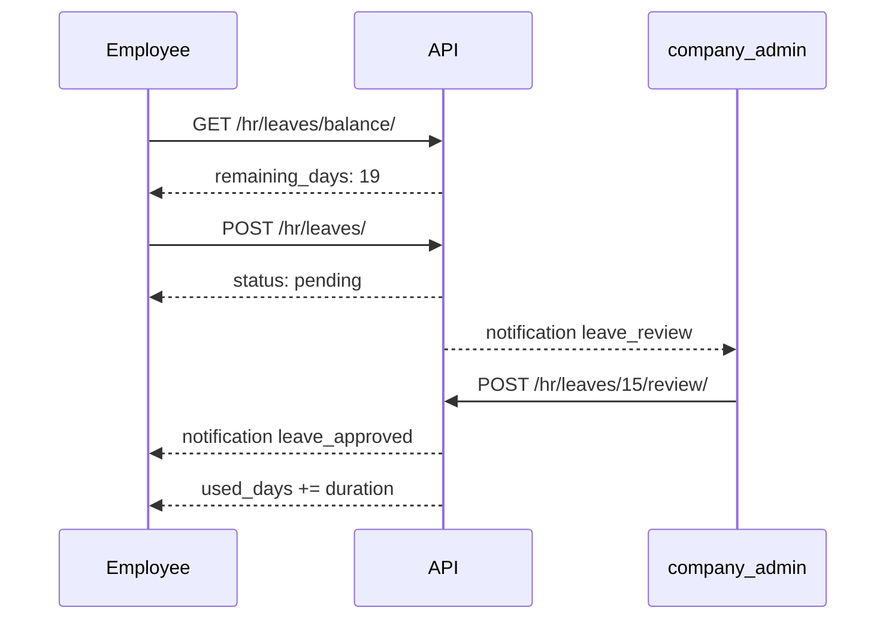

# HR — Отпуска и онбординг

> Базовый префикс: `/api/v1/hr/`  
> Подключение: [← Основная документация](mobile_api.md)

Заявки на отпуск, баланс дней, онбординг новых сотрудников.

---

## Заявки на отпуск (Leaves)

### ✅ GET /api/v1/hr/leaves/

> Список заявок. Employee видит только свои; `company_admin` — все заявки компании.

🔒 `employee`, `company_admin`, `superadmin`

**Request**

```http
GET /api/v1/hr/leaves/?status=pending&leave_type=vacation&user=42&year=2024
Authorization: Bearer <access_token>
```

| Параметр | Описание |
|----------|----------|
| `status` | `pending`, `approved`, `rejected`, `cancelled` |
| `leave_type` | `vacation`, `day_off`, `sick_leave`, `remote` |
| `user` | ID сотрудника (для admin) |
| `year` | Год по `start_date` |

**Response 200** — пагинированный список:

```json
{
  "count": 1,
  "results": [
    {
      "id": 15,
      "user": 42,
      "user_name": "Иван Петров",
      "company": 5,
      "leave_type": "vacation",
      "status": "pending",
      "start_date": "2024-07-01",
      "end_date": "2024-07-05",
      "duration_days": 5,
      "comment": "Семейный отпуск",
      "assigned_reviewer": null,
      "assigned_reviewer_name": null,
      "reviewed_by": null,
      "reviewer": null,
      "review_comment": "",
      "reviewed_at": null,
      "created_at": "2024-06-15T10:00:00Z"
    }
  ]
}
```

---

### ✅ POST /api/v1/hr/leaves/

> Подать заявку на отпуск.

**Request (employee)**

```json
{
  "leave_type": "vacation",
  "start_date": "2024-07-01",
  "end_date": "2024-07-05",
  "comment": "Семейный отпуск"
}
```

**Request (company_admin)** — обязателен `assigned_reviewer`:

```json
{
  "leave_type": "remote",
  "start_date": "2024-07-10",
  "end_date": "2024-07-10",
  "comment": "Удалённо",
  "assigned_reviewer": 7
}
```

| Поле | Обязательно | Описание |
|------|-------------|----------|
| `leave_type` | да | См. таблицу ниже |
| `start_date` | да | `YYYY-MM-DD`, не в прошлом |
| `end_date` | да | `YYYY-MM-DD`, ≥ `start_date` |
| `comment` | нет | Комментарий сотрудника |
| `assigned_reviewer` | для admin | Другой активный `company_admin` той же компании |

| `leave_type` | Списывает баланс | Описание |
|--------------|------------------|----------|
| `vacation` | да | Оплачиваемый отпуск |
| `day_off` | да | Отгул |
| `sick_leave` | нет | Больничный |
| `remote` | нет | Удалённая работа |

**Response 201** — объект заявки со `status: "pending"`.

После создания админы (или назначенный reviewer) получают уведомление `leave_review`.

**Ошибки**

| Код | Когда | Что делать мобильщику |
|-----|-------|----------------------|
| 400 | `start_date` в прошлом | Выбрать будущую дату |
| 400 | Пересечение с approved-заявкой | Показать конфликт дат |
| 400 | Недостаточно дней (`vacation`/`day_off`) | Показать `GET /leaves/balance/` |
| 400 | Admin без `assigned_reviewer` | Выбрать коллегу-admin |
| 400 | Единственный admin в компании | Невозможно подать заявку |

---

### ✅ GET /api/v1/hr/leaves/{id}/

> Детали заявки. Employee — только свои (чужие → 404).

---

### ✅ PATCH /api/v1/hr/leaves/{id}/

> Редактировать **свою** заявку в статусе `pending`.

🔒 Только автор

**Request**

```json
{
  "leave_type": "vacation",
  "start_date": "2024-07-02",
  "end_date": "2024-07-06",
  "comment": "Сдвинул даты"
}
```

---

### ✅ POST /api/v1/hr/leaves/{id}/cancel/

> Отменить свою заявку (`pending` → `cancelled`).

**Response 200** — обновлённый объект заявки.

---

### ✅ POST /api/v1/hr/leaves/{id}/review/

> Одобрить или отклонить заявку.

🔒 `company_admin` (не автор; при `assigned_reviewer` — только он)

**Request**

```json
{
  "status": "approved",
  "review_comment": "Согласовано"
}
```

| `status` | Результат |
|----------|-----------|
| `approved` | Списание дней (для `vacation`/`day_off`) |
| `rejected` | Без списания |

**Response 200** — обновлённая заявка. Сотрудник получает уведомление `leave_approved` / `leave_rejected`.

**Ошибки**

| Код | Когда |
|-----|-------|
| 403 | Не admin, автор сам себе, не тот reviewer |
| 400 | Недостаточно дней при approve |
| 400 | Пересечение с другой approved-заявкой |

---

## Баланс отпуска

### ✅ GET /api/v1/hr/leaves/balance/

> Мой баланс за год.

**Request**

```http
GET /api/v1/hr/leaves/balance/?year=2024
```

| Параметр | Default |
|----------|---------|
| `year` | Текущий год |

**Response 200**

```json
{
  "year": 2024,
  "total_days": 24,
  "used_days": 5,
  "remaining_days": 19
}
```

> `total_days` по умолчанию из `CompanySettings.vacation_days_per_year` (fallback **24**).

---

### ✅ POST /api/v1/hr/leaves/balance/set/

> Установить годовой лимит сотруднику.

🔒 `company_admin`, `superadmin`

**Request**

```json
{
  "user_id": 42,
  "year": 2024,
  "total_days": 28
}
```

**Response 200**

```json
{
  "user_id": 42,
  "user_name": "Иван Петров",
  "year": 2024,
  "total_days": 28,
  "used_days": 5,
  "remaining_days": 23
}
```

---

### ✅ GET /api/v1/hr/leaves/balance/team/

> Балансы всех `employee` компании.

🔒 `company_admin`, `superadmin`

**Response 200** — массив `LeaveBalanceTeamSerializer` (без пагинации).

---

## Онбординг — шаблоны

### ✅ GET /api/v1/hr/onboarding/templates/

### ✅ POST /api/v1/hr/onboarding/templates/

### ✅ PATCH /api/v1/hr/onboarding/templates/{id}/

🔒 `company_admin`, `superadmin`

> Управление шаблонами онбординга. При создании автоматически добавляются **6 системных шагов** + кастомные.

**POST Request**

```json
{
  "name": "Онбординг разработчиков",
  "is_active": true,
  "steps": [
    {
      "title": "Настроить Git",
      "description": "Клонировать репозитории",
      "url": "https://gitlab.company.com",
      "order": 7
    }
  ]
}
```

**Response 201** — фрагмент:

```json
{
  "id": 3,
  "name": "Онбординг разработчиков",
  "is_active": true,
  "is_default": false,
  "steps": [
    {
      "id": 10,
      "title": "Заполнить профиль",
      "description": "Добавьте фото, должность и контактные данные",
      "url": "/profile",
      "order": 1,
      "is_system": true
    }
  ],
  "created_at": "2024-06-01T10:00:00Z"
}
```

| Системный шаг | `url` (web) |
|---------------|-------------|
| Заполнить профиль | `/profile` |
| Познакомиться с командой | `/team` |
| Изучить доски проектов | `/crm` |
| Забронировать рабочее место | `/bookings` |
| Прочитать правила БЦ | `/rules` |
| Настроить уведомления | `/settings/notifications` |

> PATCH с `steps` заменяет только **кастомные** шаги; системные (`is_system: true`) неизменяемы.

---

### ✅ POST /api/v1/hr/onboarding/templates/{id}/set-default/

> Назначить шаблон дефолтным. Снимает флаг с предыдущего. Инициализирует progress для всех `employee` компании.

**Response 200** — обновлённый шаблон.

---

## Онбординг — шаги шаблона

### ✅ GET /api/v1/hr/onboarding/templates/{template_id}/steps/

### ✅ POST /api/v1/hr/onboarding/templates/{template_id}/steps/

### ✅ PATCH /api/v1/hr/onboarding/templates/{template_id}/steps/{id}/

### ✅ DELETE /api/v1/hr/onboarding/templates/{template_id}/steps/{id}/

🔒 `company_admin`, `superadmin`

**POST Request (кастомный шаг)**

```json
{
  "title": "Пройти security-тренинг",
  "description": "Обязательный курс",
  "url": "https://learn.company.com/security",
  "order": 7
}
```

| Ограничение | Описание |
|-------------|----------|
| `is_system: true` | PATCH/DELETE → **400** (неизменяем) |

---

## Онбординг — прогресс

### ✅ GET /api/v1/hr/onboarding/progress/

> Мой прогресс по активному шаблону компании (`is_default` → иначе первый активный).

🔒 Любой авторизованный пользователь

**Response 200**

```json
{
  "completed": false,
  "steps": [
    {
      "id": 10,
      "title": "Заполнить профиль",
      "is_completed": true,
      "url": "/profile"
    },
    {
      "id": 11,
      "title": "Познакомиться с командой",
      "is_completed": false,
      "url": "/team"
    }
  ]
}
```

> Если шаблона нет или progress не инициализирован: `{ "completed": true, "steps": [] }`.

Progress создаётся при регистрации по инвайту и при `set-default`.

---

### ✅ POST /api/v1/hr/onboarding/progress/steps/{step_id}/complete/

> Отметить шаг выполненным.

**Response 200**

```json
{
  "id": 11,
  "is_completed": true
}
```

---

### ✅ GET /api/v1/hr/onboarding/progress/team/

> Сводка онбординга по команде.

🔒 `company_admin`, `superadmin`

**Response 200**

```json
[
  {
    "user": 42,
    "first_name": "Иван",
    "last_name": "Петров",
    "avatar": null,
    "role": "employee",
    "completed_steps": 3,
    "total_steps": 8
  }
]
```

---

### ✅ GET /api/v1/hr/onboarding/progress/team/{user_id}/

> Детальный прогресс конкретного сотрудника.

🔒 `company_admin`, `superadmin`

**Response 200**

```json
{
  "user": {
    "id": 42,
    "first_name": "Иван",
    "last_name": "Петров",
    "avatar": null
  },
  "completed_steps": 3,
  "total_steps": 8,
  "steps": [
    {
      "id": 10,
      "title": "Заполнить профиль",
      "is_system": true,
      "is_completed": true,
      "completed_at": "2024-06-10T09:00:00Z"
    }
  ]
}
```

---

### Важные детали для мобильщиков (HR)

#### Доступ

| Роль | Отпуска | Онбординг (шаблоны) | Онбординг (прогресс) |
|------|---------|---------------------|----------------------|
| `employee` | Свои заявки + balance | — | Свой progress |
| `company_admin` | Все заявки компании + review + team balance | CRUD шаблонов | Team progress |
| `superadmin` | Все компании | + `company_id` query | Team progress |
| `guest`, `reception`, `service_manager` | **403** на `/leaves/` | **403** | Progress (пустой) |

Отпуска требуют `IsCompanyMember` и привязку к компании.

#### Мобильные экраны → эндпоинты

| Экран | Эндпоинты |
|-------|-----------|
| Мои заявки | `GET /hr/leaves/` |
| Подать заявку | `POST /hr/leaves/` |
| Баланс дней | `GET /hr/leaves/balance/` |
| Очередь на согласование (admin) | `GET /hr/leaves/?status=pending` |
| Approve/Reject | `POST /hr/leaves/{id}/review/` |
| Чеклист онбординга | `GET /onboarding/progress/` |
| Отметить шаг | `POST /onboarding/progress/steps/{id}/complete/` |
| Прогресс команды (admin) | `GET /onboarding/progress/team/` |

#### Баланс и типы отпуска

- Списание дней: только `vacation` и `day_off` при **approve**.
- `sick_leave` и `remote` не уменьшают баланс.
- При создании `vacation`/`day_off` проверяется `remaining_days`.
- `duration_days` = `(end_date - start_date) + 1` (календарные дни).

#### Reviewer для admin

Если заявку подаёт `company_admin`:
- нужен другой активный `company_admin` в `assigned_reviewer`;
- уведомление получает только назначенный reviewer;
- один admin в компании не может подать заявку.

Для `employee` reviewer не указывается — уведомления идут всем admin (кроме автора).

#### Системные шаги онбординга

`url` в шагах — web-пути. На мобильном маппить на нативные экраны:

| `url` | Экран в приложении |
|-------|-------------------|
| `/profile` | Профиль |
| `/team` | Команда |
| `/crm` | CRM |
| `/bookings` | Бронирование |
| `/rules` | Правила БЦ |
| `/settings/notifications` | Настройки уведомлений |

Внешние URL (`https://...`) открывать в WebView / браузере.

#### Рекомендуемый flow заявки



#### Ограничения

- Редактирование и отмена — только `pending`.
- Даты не в прошлом; пересечение с `approved` блокируется.
- Шаблоны онбординга без пагинации (список обычно короткий).
- Список заявок — стандартная DRF-пагинация (20 на страницу).

---
