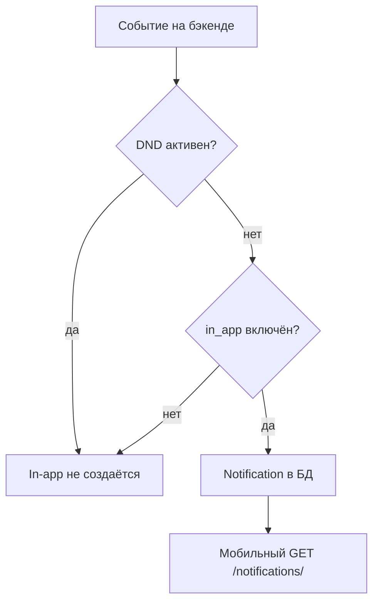

# Notifications — Уведомления

> Базовый префикс: `/api/v1/notifications/`  
> Подключение: [← Основная документация](mobile_api.md)

In-app уведомления, счётчик непрочитанных, настройки каналов и Do Not Disturb.

---

## Список уведомлений

### ✅ GET /api/v1/notifications/

> Пагинированный список уведомлений текущего пользователя.

🔒 Любой авторизованный пользователь (только **свои**)

**Request**

```http
GET /api/v1/notifications/?is_read=false&notification_type=task_assigned&page=1
Authorization: Bearer <access_token>
```

| Параметр | Описание |
|----------|----------|
| `is_read` | `true` \| `false` |
| `notification_type` | Фильтр по типу (см. таблицу ниже) |
| `page`, `page_size` | Стандартная DRF-пагинация (default 20) |

**Response 200**

```json
{
  "count": 12,
  "next": null,
  "previous": null,
  "results": [
    {
      "id": 101,
      "type": "task_assigned",
      "title": "Вам назначена задача",
      "message": "Подготовить презентацию",
      "link": "/crm/tasks/55/",
      "is_read": false,
      "created_at": "2024-06-15T10:30:00Z"
    }
  ]
}
```

| Поле API | Модель | Описание |
|----------|--------|----------|
| `type` | `notification_type` | Тип события |
| `message` | `body` | Текст уведомления |
| `link` | `url` | Web-путь для навигации |

> Отдельного `GET /notifications/{id}/` нет — используйте list + фильтры.

---

### ✅ GET /api/v1/notifications/unread-count/

> Бейдж непрочитанных (для иконки колокольчика).

**Response 200**

```json
{
  "count": 5
}
```

---

### ✅ POST /api/v1/notifications/{id}/read/

> Отметить одно уведомление прочитанным.

**Response 200** — обновлённый объект `NotificationSerializer`.

---

### ✅ POST /api/v1/notifications/read-all/

> Отметить все непрочитанные как прочитанные.

**Response 200**

```json
{
  "detail": "All marked as read"
}
```

---

### ✅ DELETE /api/v1/notifications/{id}/

> Удалить уведомление из списка.

**Response 204**

---

## Типы уведомлений

Типы, которые реально создаёт бэкенд (фрагмент по модулям):

| `type` | Источник | Когда |
|--------|----------|-------|
| `booking_confirmed` | Bookings | Бронь подтверждена |
| `booking_reminder` | Bookings | Напоминание о брони |
| `booking_cancelled` | Bookings | Бронь отменена |
| `booking_completed` | Bookings | Бронь завершена |
| `task_assigned` | CRM | Назначена задача |
| `task_moved` | CRM | Задача перемещена |
| `task_comment` | CRM | Новый комментарий |
| `task_deadline` / `task_deadline_soon` / `task_deadline_overdue` | CRM | Дедлайн задачи |
| `guest_validated` | Access | QR гостя отсканирован |
| `guest_pass_expiring` | Access | Пропуск скоро истечёт |
| `service_request_update` | Services | Обновление заявки |
| `announcement` / `announcement_company` / `announcement_building` | Services | Новое объявление |
| `invitation` / `invite_received` | Companies | Приглашение |
| `leave_review` | HR | Заявка на отпуск (admin) |
| `leave_approved` / `leave_rejected` | HR | Решение по отпуску |
| `new_employee` | Users | Новый сотрудник (admin) |
| `system` | Core | Системные |

Фильтр в list: `?notification_type=task_assigned` (имя из модели, не alias).

---

## Настройки (Preferences)

### ✅ GET /api/v1/notifications/preferences/

### ✅ PATCH /api/v1/notifications/preferences/

> Per-type настройки in-app и email. Запись создаётся автоматически при первом обращении.

🔒 Любой авторизованный пользователь

**GET Response 200**

```json
{
  "dnd_enabled": false,
  "dnd_until": null,
  "booking_confirmed": {
    "in_app": true,
    "email": true
  },
  "task_moved": {
    "in_app": true
  },
  "task_assigned": {
    "in_app": true,
    "email": true
  },
  "announcement": {
    "in_app": true,
    "email": true
  }
}
```

| Поле | Описание |
|------|----------|
| `in_app` | Показывать в ленте уведомлений |
| `email` | Только для типов с реальной email-отправкой (см. ниже) |

**PATCH Request** (частичное обновление):

```json
{
  "task_comment": {
    "in_app": false
  },
  "booking_reminder": {
    "email": false
  }
}
```

> `dnd_enabled` / `dnd_until` **read-only** здесь — меняйте через `/do-not-disturb/`.

**Типы с email-переключателем** (`email` в ответе):

`booking_confirmed`, `booking_completed`, `task_assigned`, `task_deadline`, `leave_review`, `guest_validated`, `announcement`, `new_employee`

**Видимость типов по роли**

| Роль | Типы в preferences |
|------|-------------------|
| `employee` | booking*, task*, service, announcement, system |
| `company_admin` | + guest*, invitation, leave_review, new_employee |
| `guest` | guest_validated, guest_pass_expiring, announcement, system |
| `superadmin` | Все настраиваемые типы |

---

## Do Not Disturb

### ✅ POST /api/v1/notifications/do-not-disturb/

> Включить/выключить режим «не беспокоить». При активном DND **in-app** уведомления не создаются.

**Request — включить на 2 часа**

```json
{
  "enabled": true,
  "until": "2024-06-15T14:00:00Z"
}
```

**Request — бессрочно**

```json
{
  "enabled": true
}
```

**Request — выключить**

```json
{
  "enabled": false
}
```

**Response 200**

```json
{
  "dnd_enabled": true,
  "dnd_until": "2024-06-15T14:00:00Z"
}
```

| Правило | Описание |
|---------|----------|
| `until` | Должен быть в будущем; при `enabled: false` игнорируется |
| `until: null` | DND без срока (пока не выключите) |

---

## Unsubscribe (email)

### ✅ GET /api/v1/notifications/unsubscribe/?token={signed_token}

> Отключить **все** email-уведомления по ссылке из письма.

🔓 Без авторизации · redirect на web

**Response 302** → `{FRONTEND_URL}/unsubscribe/success` или `/unsubscribe/invalid`

> Для мобильного приложения не используется напрямую — только в email-шаблонах.

---

### Важные детали для мобильщиков (Notifications)

#### Доступ

| Эндпоинт | Кто |
|----------|-----|
| list, unread-count, read, read-all, delete | Любой авторизованный (только свои) |
| preferences, do-not-disturb | Любой авторизованный |
| unsubscribe | Публичный (из email) |

`reception`, `service_manager` — работают как обычные авторизованные пользователи (набор типов зависит от роли).

#### Мобильные экраны → эндпоинты

| Экран | Эндпоинты |
|-------|-----------|
| Колокольчик (бейдж) | `GET /unread-count/` |
| Лента | `GET /notifications/?is_read=false` |
| Тап по уведомлению | `POST /{id}/read/` → navigate по `link` |
| «Прочитать все» | `POST /read-all/` |
| Настройки | `GET/PATCH /preferences/` |
| DND toggle | `POST /do-not-disturb/` |

#### Навигация по `link`

`link` — web-пути. Маппинг на нативные экраны:

| `link` (пример) | Экран |
|-----------------|-------|
| `/crm/tasks/55/` | CRM задача #55 |
| `/hr/leaves` | HR заявки |
| `/leave` | Мои отпуска |
| `/access/` | Гостевые пропуска |
| `/service-requests/` | Сервисные заявки |
| `/bookings` | Бронирования |
| `/files?shared_file_id=101` | Storage / shared file |

#### Polling vs push

API **не** содержит FCM/APNs регистрации device token. Рекомендуемый паттерн:

1. При foreground — polling `unread-count` каждые N секунд или после действий.
2. При открытии колокольчика — `GET /notifications/`.
3. Email — отдельный канал, управляется preferences.

#### DND и preferences



Отключение `in_app` для типа → `create_notification` возвращает `null`, запись не появится.

#### Email defaults (для UI подсказок)

| Категория | Email default |
|-----------|---------------|
| Транзакционные (booking confirmed, task assigned, invitation…) | **вкл** |
| Информационные (task moved/comment, service update…) | **выкл** |
| `booking_completed`, `system` | email выкл / нет toggle |

#### Ограничения

- Нет `GET /notifications/{id}/` — только list.
- Фильтр: `notification_type`, в ответе поле — `type`.
- `read-all` не возвращает обновлённый count — перезапросите `unread-count`.
- Unsubscribe token живёт **30 дней**.

---
