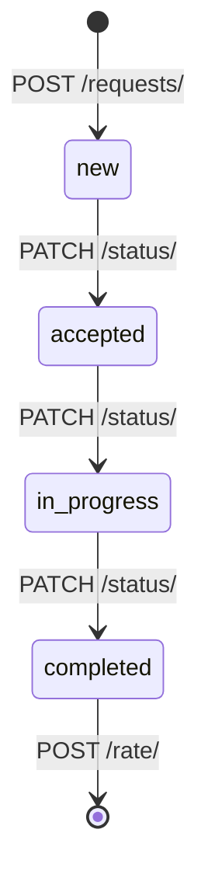

# Services — Этажи, карта, заявки, объявления

> Базовый префикс: `/api/v1/services/`  
> Подключение: [← Основная документация](mobile_api.md)

Интерактивная карта здания, сервисные заявки (уборка, ремонт) и лента объявлений.

---

## Этажи (Floors)

### ✅ GET /api/v1/services/floors/

> Список этажей с загрузкой (`occupancy_pct`) и URL плана.

🔒 `guest`, `employee`, `company_admin`, `superadmin`

**Response 200** — пагинация (default **50** на страницу, `page_size` до 500):

```json
{
  "count": 5,
  "results": [
    {
      "id": 3,
      "number": 3,
      "name": "Этаж 3",
      "plan_image": "floors/plans/floor3.png",
      "plan_image_url": "https://your-domain.com/media/floors/plans/floor3.png",
      "occupancy_pct": 42,
      "created_at": "2024-01-15T09:00:00Z",
      "updated_at": "2024-03-20T14:30:00Z"
    }
  ]
}
```

| Видимость | Кто видит |
|-----------|-----------|
| Глобальные этажи | `company = null` — все |
| Этажи компании | Дополнительно для сотрудников этой компании |

---

### ✅ GET /api/v1/services/floors/{id}/

> Детали этажа + вложенные `map_points` (статус ресурсов на **сейчас**).

**Response 200** — фрагмент `map_points`:

```json
{
  "id": 3,
  "number": 3,
  "name": "Этаж 3",
  "plan_image_url": "https://your-domain.com/media/floors/plans/floor3.png",
  "occupancy_pct": 42,
  "map_points": [
    {
      "id": 100,
      "floor": 3,
      "point_type": "desk",
      "label": "Стол A-01",
      "x": 15.0,
      "y": 20.0,
      "width": 5.0,
      "height": 4.0,
      "resource": 50,
      "resource_name": "Стол A-01",
      "resource_status": "free",
      "resource_status_reason": "no_active_booking_or_block",
      "next_free_at": null,
      "company": 7,
      "company_name": "ACME"
    }
  ]
}
```

---

### ✅ GET /api/v1/services/floors/{id}/map/

> Карта этажа со статусами ресурсов на указанный момент времени.

**Request**

```http
GET /api/v1/services/floors/3/map/?datetime=2024-06-15T14:00:00+06:00
```

| `resource_status` | Описание |
|-------------------|----------|
| `free` | Свободен |
| `soon_available` | Занят, освободится ≤ **30 мин** |
| `occupied` | Занят |
| `blocked` | Заблокирован (`ResourceBlock`) |
| `null` | Не бронируемая точка (кухня, лифт…) |

**Response 200**

```json
{
  "floor_id": 3,
  "floor_name": "Этаж 3",
  "at_time": "2024-06-15T14:00:00+06:00",
  "points": []
}
```

---

### ✅ POST /api/v1/services/floors/

### ✅ PATCH /api/v1/services/floors/{id}/

### ✅ DELETE /api/v1/services/floors/{id}/

🔒 Только `superadmin` (multipart для `plan_image`)

---

## Точки на карте (Map Points)

### ✅ GET /api/v1/services/map-points/

🔒 Любой авторизованный пользователь

| `point_type` | Описание |
|--------------|----------|
| `desk`, `meeting_room`, `parking`, `capsule` | Бронируемые (нужен `resource`) |
| `office` | Нужен `company` |
| `toilet`, `kitchen`, `elevator`, `exit`, `other` | Справочные |

Координаты `x`, `y`, `width`, `height` — **0–100%** от плана этажа.

---

### ✅ GET /api/v1/services/map-points/search/?q={query}

> Поиск по `label` и имени ресурса.

**Response 200** — массив (без пагинации).

---

### ✅ POST / PATCH / DELETE /api/v1/services/map-points/

🔒 Только `superadmin`

---

## Сервисные заявки (Requests)

### ✅ GET /api/v1/services/requests/

> Список заявок. Employee/guest — только свои; `company_admin` — компании; `service_manager`/`superadmin` — все.

🔒 `guest`, `employee`, `company_admin`, `superadmin`, `service_manager` (read)

**Request**

```http
GET /api/v1/services/requests/?request_type=cleaning&status=new&urgency=high&floor=3
```

| Параметр | Описание |
|----------|----------|
| `request_type` / `type` | `cleaning`, `repair`, `supplies`, `general` |
| `status` | `new`, `accepted`, `in_progress`, `completed` |
| `urgency` | `low`, `medium`, `high`, `normal`, `urgent` |
| `floor` | ID этажа |

**Response 200** — пагинированный список.

---

### ✅ POST /api/v1/services/requests/

> Создать заявку. Поддерживает multipart (поле `photo`).

**Request**

```json
{
  "request_type": "cleaning",
  "urgency": "high",
  "floor": 3,
  "location": "Переговорная B-201",
  "description": "Нужна уборка после встречи"
}
```

| Поле | Обязательно | Описание |
|------|-------------|----------|
| `request_type` | да | Тип заявки |
| `urgency` | да | Приоритет |
| `floor` | да | ID этажа или **номер** этажа |
| `location` | да | Место на этаже |
| `description` | да | Описание |
| `photo` | нет | Фото (multipart) |

**Response 201** — объект заявки со `status: "new"`. `service_manager` получают уведомление.

---

### ✅ GET /api/v1/services/requests/{id}/

> Детали заявки.

---

### ✅ POST /api/v1/services/requests/quick-cleaning/

> Быстрая заявка на уборку (этаж из последнего бронирования, если не указан).

**Request**

```json
{
  "floor": 3,
  "location": "Моё рабочее место",
  "description": "Быстрая уборка"
}
```

| Поле | Описание |
|------|----------|
| `floor` | Опционально; иначе — из последнего `Booking` пользователя |

> Legacy-алиас: `POST .../requests/cleaning/` (deprecated).

**Response 201** — `request_type: cleaning`, `urgency: low`.

---

### ✅ PATCH /api/v1/services/requests/{id}/status/

> Сменить статус (строгая цепочка).

🔒 `superadmin`, `service_manager`

**Request**

```json
{
  "status": "accepted"
}
```

| Переход | Следующий статус |
|---------|------------------|
| `new` | `accepted` |
| `accepted` | `in_progress` |
| `in_progress` | `completed` |

> Legacy-алиас: `PATCH .../update-status/` (deprecated).

При `completed` проставляется `completed_at`, создателю — уведомление.

---

### ✅ PATCH /api/v1/services/requests/{id}/assign/

> Назначить исполнителя.

🔒 `superadmin`, `service_manager`

**Request**

```json
{
  "assigned_to": 55
}
```

`assigned_to: null` — снять назначение.

| Ограничение | Описание |
|-------------|----------|
| Исполнитель | Активный пользователь, не `guest` |
| `service_manager` | Макс. 1 активная (не `completed`) заявка |
| `service_manager` | Не может перехватить чужую назначенную заявку |

---

### ✅ POST /api/v1/services/requests/{id}/rate/

> Оценить выполненную заявку (1–5 звёзд).

🔒 Только создатель

**Request**

```json
{
  "rating": 5
}
```

| Код | Когда |
|-----|-------|
| 400 | Не `completed` или уже оценена |
| 403 | Не автор заявки |

---

## Объявления (Announcements)

### ✅ GET /api/v1/services/announcements/

> Лента объявлений с cursor-пагинацией (infinite scroll).

🔒 Любой авторизованный (read)

**Request**

```http
GET /api/v1/services/announcements/?category=important&is_pinned=true&cursor=...
```

| Параметр | Описание |
|----------|----------|
| `category` | `info`, `important`, `event` |
| `is_pinned` | `true` / `false` |
| `cursor` | Opaque cursor из `next` |
| `page_size` | До 100 (default 20) |

| Кто | Видит |
|-----|-------|
| `guest` | Только БЦ (`company_id = null`) |
| `employee`, `company_admin` | БЦ + своя компания |
| `superadmin` | Всё |

**Response 200** — cursor-формат (без `count`):

```json
{
  "next": "eyJvZmZzZXQiOjIwfQ==",
  "previous": null,
  "results": [
    {
      "id": 8,
      "scope": "building",
      "company_id": null,
      "author": 1,
      "author_name": "Администрация БЦ",
      "title": "Плановое отключение воды",
      "text": "15 июня с 10:00 до 14:00...",
      "category": "important",
      "image": null,
      "is_pinned": true,
      "notify_email": true,
      "is_read": false,
      "read_count": 42,
      "created_at": "2024-06-10T08:00:00Z"
    }
  ]
}
```

| Поле | Описание |
|------|----------|
| `scope` | `building` \| `company` (read-only, из `company_id`) |
| `text` | Тело объявления (в API — не `body`) |
| `is_read` | Прочитано текущим пользователем |
| `read_count` | Только admin / автор / superadmin |

---

### ✅ POST /api/v1/services/announcements/

> Создать объявление.

🔒 `company_admin`, `superadmin`

**Request**

```json
{
  "title": "Корпоратив в пятницу",
  "text": "Сбор в 18:00 в лобби",
  "category": "event",
  "is_pinned": false,
  "notify_email": false,
  "company_id": 5
}
```

| Кто | `company_id` |
|-----|--------------|
| `superadmin` | `null` = объявление БЦ; число = компания |
| `company_admin` | Всегда принудительно своя компания |

> Email-рассылка: только при `is_pinned: true` **и** `notify_email: true`.

---

### ✅ GET /api/v1/services/announcements/{id}/

> Детали объявления.

---

### ✅ POST /api/v1/services/announcements/{id}/read/

> Отметить прочитанным.

🔒 Любой авторизованный

**Response 200** — объект с `is_read: true`.

---

### ✅ DELETE /api/v1/services/announcements/{id}/

🔒 Автор или `superadmin`

**Response 204**

---

### Важные детали для мобильщиков (Services)

#### Доступ по ролям

| Роль | Этажи/карта | Заявки | Объявления |
|------|-------------|--------|------------|
| `guest` | Читать глобальные этажи | Создать/свои | Только БЦ |
| `employee` | Читать | Создать/свои | БЦ + компания |
| `company_admin` | Читать | Все компании + создать | БЦ + компания + публиковать |
| `service_manager` | **403** | Все + status/assign | Read (как employee?) |

`service_manager` не в `IsGuestOrCompanyMember` — **нет доступа к этажам**, но видит все заявки.

`reception` — **403** на floors/requests/announcements (кроме своих ролевых эндпоинтов в Access).

#### Мобильные экраны → эндпоинты

| Экран | Эндпоинты |
|-------|-----------|
| Список этажей | `GET /services/floors/` |
| Карта этажа | `GET /floors/{id}/map/` |
| Поиск на карте | `GET /map-points/search/?q=` |
| Мои заявки | `GET /services/requests/` |
| Создать заявку | `POST /services/requests/` |
| Быстрая уборка | `POST /requests/quick-cleaning/` |
| Оценить | `POST /requests/{id}/rate/` |
| Лента новостей | `GET /announcements/` + cursor `next` |
| Прочитано | `POST /announcements/{id}/read/` |

#### Карта и бронирование

- Точки `desk`/`meeting_room`/`parking`/`capsule` связаны с `bookings.Resource`.
- `resource_status` на карте синхронизирован с бронированиями (см. [Bookings](mobile_api_bookings.md)).
- `soon_available` — освобождение в течение 30 минут.

#### Workflow заявки



`company_admin` **не** меняет статус — только `service_manager` / `superadmin`.

#### Объявления — infinite scroll

Используйте **cursor pagination**, не page number:

```http
GET /announcements/?page_size=20
GET /announcements/?cursor={next из предыдущего ответа}
```

Сортировка: `is_pinned` desc → `created_at` desc.

#### Quick cleaning

Если пользователь не передал `floor`, сервер ищет этаж последнего бронирования. Без бронирований — **400**.

#### Ограничения

- Управление этажами и map-points — только superadmin (мобильное приложение обычно read-only).
- Заявки: нет DELETE; статус меняется только через `/status/`.
- Объявления: поле контента — **`text`**, не `body`.
- `occupancy_pct` на списке этажей — % занятых ресурсов прямо сейчас.

---
