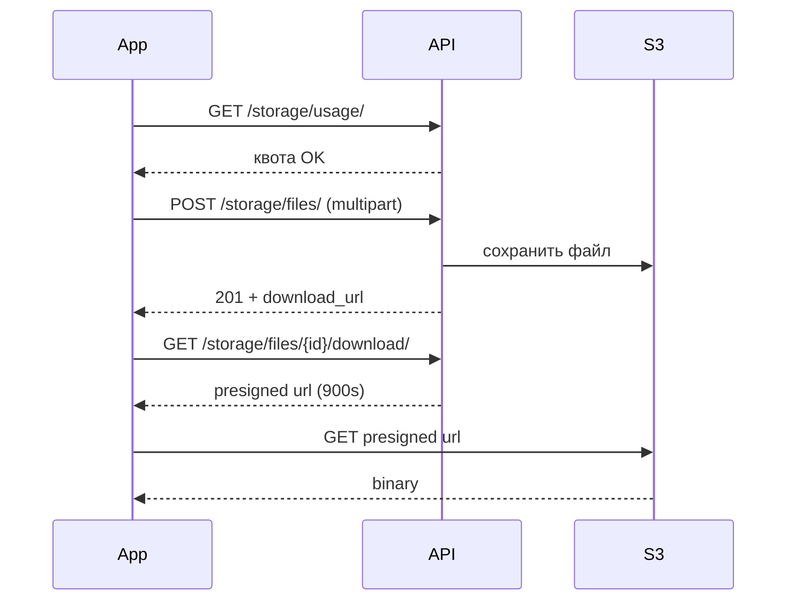

# Storage — Файлы и папки

> Базовый префикс: `/api/v1/storage/`  
> Подключение: [← Основная документация](mobile_api.md)

Личное и корпоративное хранилище: папки, файлы, шаринг, ACL папок, корзина и квоты.

---

## Использование диска

### ✅ GET /api/v1/storage/usage/

> Статистика по личному и корпоративному хранилищу текущего пользователя.

🔒 `guest`, `employee`, `company_admin`, `superadmin`

**Response 200**

```json
{
  "personal": {
    "used_bytes": 52428800,
    "file_count": 12,
    "limit_bytes": 5368709120,
    "trash_bytes": 1048576,
    "breakdown": {
      "document": 30000000,
      "image": 15000000,
      "archive": 5000000,
      "media": 2000000,
      "other": 428800
    }
  },
  "company": {
    "used_bytes": 2147483648,
    "limit_bytes": 5368709120,
    "file_count": 87,
    "trash_bytes": 0,
    "breakdown": {
      "document": 1800000000,
      "image": 200000000,
      "archive": 100000000,
      "media": 40000000,
      "other": 7483648
    }
  }
}
```

| Поле | Описание |
|------|----------|
| `used_bytes` | Включая файлы в корзине (они всё ещё занимают квоту) |
| `limit_bytes` | `null` — без лимита (пользователь без компании) |
| `company` | `null` для `guest` |
| `breakdown` | Категории: `document`, `image`, `archive`, `media`, `other` |

> `company.used_bytes` включает прямые CRM-вложения (без записи в Storage).

---

## Папки (Folders)

### ✅ GET /api/v1/storage/folders/

> Список папок, доступных пользователю.

🔒 `IsGuestOrCompanyMember`

**Request**

```http
GET /api/v1/storage/folders/?scope=personal&parent_id=null
Authorization: Bearer <access_token>
```

| Параметр | Описание |
|----------|----------|
| `scope` | `personal` \| `company` |
| `parent_id` | ID родителя; `null` — только корневые |

**Response 200** — пагинированный список:

```json
{
  "count": 2,
  "results": [
    {
      "id": 10,
      "name": "Документы",
      "scope": "personal",
      "parent": null,
      "owner": 42,
      "children_count": 3,
      "files_count": 5,
      "is_restricted": false,
      "user_permission": null,
      "created_at": "2024-03-01T10:00:00Z",
      "updated_at": "2024-06-01T12:00:00Z"
    }
  ]
}
```

| Поле | Описание |
|------|----------|
| `is_restricted` | Есть явные ACL на папке |
| `user_permission` | `view` \| `upload` \| `full` для employee; `null` = полный доступ (admin/owner) |

---

### ✅ POST /api/v1/storage/folders/

> Создать папку.

**Request**

```json
{
  "name": "Договоры",
  "scope": "company",
  "parent_id": 10
}
```

Альтернатива: `is_company_shared: true` вместо `scope: "company"`.

| Поле | Описание |
|------|----------|
| `scope` | `personal` (default) \| `company` |
| `parent_id` | Родительская папка того же scope |
| `name` | Обязательно |

**Response 201** — объект `FolderSerializer`.

> `guest` всегда создаёт только `personal`.

---

### ✅ GET /api/v1/storage/folders/{id}/

> Содержимое папки: метаданные + вложенные `folders` + `files`.

**Response 200** — фрагмент:

```json
{
  "id": 10,
  "name": "Документы",
  "scope": "company",
  "parent": null,
  "owner": 42,
  "children_count": 2,
  "files_count": 5,
  "is_restricted": true,
  "user_permission": "upload",
  "folders": [],
  "files": [
    {
      "id": 101,
      "name": "contract.pdf",
      "size": 1048576,
      "mime_type": "application/pdf",
      "download_url": "https://your-domain.com/api/v1/storage/files/101/download/",
      "owner": 42,
      "owner_name": "Иван Петров",
      "folder": 10,
      "created_at": "2024-06-10T09:00:00Z"
    }
  ],
  "created_at": "2024-03-01T10:00:00Z",
  "updated_at": "2024-06-01T12:00:00Z"
}
```

---

### ✅ PATCH /api/v1/storage/folders/{id}/

> Переименовать (`name`) или переместить (`parent`).

**Request**

```json
{
  "name": "Архив 2024",
  "parent": 15
}
```

---

### ✅ DELETE /api/v1/storage/folders/{id}/

> Soft-delete папки рекурсивно (все вложенные папки и файлы).

**Response 204**

---

### ✅ POST /api/v1/storage/folders/{id}/restore/

> Восстановить папку из корзины (вместе с файлами внутри).

**Response 204**

---

### ✅ DELETE /api/v1/storage/folders/{id}/permanent/

> Безвозвратно удалить папку из корзины (S3 + БД).

**Response 204**

---

### ✅ GET /api/v1/storage/folders/{id}/permissions/

### ✅ POST /api/v1/storage/folders/{id}/permissions/

🔒 Только `company_admin` или `superadmin`

**POST Request**

```json
{
  "user_id": 55,
  "permission": "upload"
}
```

или по роли:

```json
{
  "role": "employee",
  "permission": "view"
}
```

| `permission` | Доступ |
|--------------|--------|
| `view` | Просмотр и скачивание |
| `upload` | + загрузка файлов |
| `full` | + удаление и перемещение |

> Указать **либо** `user_id`, **либо** `role` — не оба.

**Response 201**

```json
{
  "id": 7,
  "folder": 10,
  "user": 55,
  "user_name": "Анна Сидорова",
  "role": null,
  "permission": "upload",
  "granted_by": 42,
  "granted_by_name": "Иван Петров",
  "created_at": "2024-06-15T10:00:00Z"
}
```

---

## Файлы (Files)

### ✅ GET /api/v1/storage/files/

> Список файлов, доступных пользователю (личные, корпоративные, расшаренные).

**Request**

```http
GET /api/v1/storage/files/?scope=company&folder_id=10&file_category=document&search=договор&ordering=-created_at
```

| Параметр | Описание |
|----------|----------|
| `scope` | `personal` \| `company` |
| `folder_id` | ID папки; `null` — файлы в корне |
| `file_category` | `image`, `media`, `archive`, `document`, `other` |
| `search` | Поиск по `name` |
| `ordering` | `name`, `file_size`, `size`, `created_at`, `file_category` (с `-`) |

**Response 200** — пагинированный список `FileSerializer`.

---

### ✅ POST /api/v1/storage/files/

> Загрузить файл (multipart).

```http
POST /api/v1/storage/files/
Content-Type: multipart/form-data
Authorization: Bearer <access_token>

file=<binary>
folder_id=10
scope=company
```

| Поле | Обязательно | Описание |
|------|-------------|----------|
| `file` | да | Бинарный файл |
| `folder_id` | нет | Папка назначения |
| `scope` / `is_company_shared` | нет | `personal` (default) \| `company` |

| Ограничение | Значение |
|-------------|----------|
| Макс. размер одного файла | **100 МБ** |
| Квота компании | `company.storage_limit_gb` |
| Квота guest | `GUEST_STORAGE_LIMIT_GB` (default **1 ГБ**) |

**Response 201**

```json
{
  "id": 101,
  "name": "contract.pdf",
  "size": 1048576,
  "mime_type": "application/pdf",
  "folder": 10,
  "owner": 42,
  "owner_name": "Иван Петров",
  "company": 5,
  "download_url": "https://your-domain.com/api/v1/storage/files/101/download/",
  "created_at": "2024-06-15T11:00:00Z",
  "updated_at": "2024-06-15T11:00:00Z"
}
```

**Ошибки**

| Код | Когда | Что делать мобильщику |
|-----|-------|----------------------|
| 400 | Файл > 100 МБ | Сжать или разбить |
| 400 | `STORAGE_LIMIT_EXCEEDED` | Показать квоту, предложить очистить корзину |
| 400 | Нет прав `upload` на папку | Запросить доступ у admin |
| 403 | Нет доступа к папке | — |

---

### ✅ GET /api/v1/storage/files/{id}/

> Метаданные файла (требуется право `view`).

---

### ✅ PATCH /api/v1/storage/files/{id}/

> Переименовать (`name`). Требуется право `full` (владелец, admin, ACL `full` или share `full`).

---

### ✅ DELETE /api/v1/storage/files/{id}/

> Soft-delete. Требуется право `full`.

**Response 204**

---

### ✅ GET /api/v1/storage/files/{id}/download/

> Presigned URL для скачивания.

**Response 200**

```json
{
  "url": "https://s3.amazonaws.com/...",
  "expires_in": 900
}
```

> `expires_in` по умолчанию **900 сек** (15 мин). Не кэшировать URL дольше срока.

---

### ✅ POST /api/v1/storage/files/{id}/move/

> Переместить файл в другую папку.

**Request**

```json
{
  "folder_id": 15
}
```

`folder_id: null` — переместить в корень scope.

---

### ✅ POST /api/v1/storage/files/bulk_delete/

> Массовое soft-delete.

**Request**

```json
{
  "ids": [101, 102, 103]
}
```

**Response 204**

---

### ✅ GET /api/v1/storage/files/{id}/shares/

> Список шарингов файла. Только владелец (или superadmin).

---

### ✅ POST /api/v1/storage/files/{id}/restore/

### ✅ DELETE /api/v1/storage/files/{id}/permanent/

> Восстановить / безвозвратно удалить из корзины. Требуется право `full`.

---

## Шаринг файлов (Shares)

### ✅ GET /api/v1/storage/shares/

🔒 `employee`, `company_admin`, `superadmin` (не `guest`)

**Request**

```http
GET /api/v1/storage/shares/?shared_with_me=true
```

| Параметр | Описание |
|----------|----------|
| `shared_with_me` | `true` — только файлы, расшаренные мне |

**Response 200** — пагинированный список.

---

### ✅ POST /api/v1/storage/shares/

> Поделиться файлом с коллегой. Только владелец файла.

**Request**

```json
{
  "file_id": 101,
  "shared_with_user_id": 55,
  "permission": "download",
  "comment": "Посмотри до пятницы"
}
```

| `permission` | Доступ получателя |
|--------------|-------------------|
| `view` | Только просмотр метаданных |
| `download` | + скачивание |
| `full` | + переименование и удаление |

**Response 201** — получатель получает push/in-app уведомление.

**Ошибки**

| Код | Когда |
|-----|-------|
| 400 | Получатель из другой компании |
| 400 | Не владелец файла |

---

### ✅ PATCH /api/v1/storage/shares/{id}/

🔒 Только `shared_by` (кто создал шаринг)

---

### ✅ DELETE /api/v1/storage/shares/{id}/

🔒 Только `shared_by`

**Response 204**

---

## Права на папки (Folder Permissions)

Отдельный ViewSet для изменения уже выданных прав.

### ✅ PATCH /api/v1/storage/folder-permissions/{id}/

🔒 `company_admin`, `superadmin`

**Request**

```json
{
  "permission": "full"
}
```

---

### ✅ DELETE /api/v1/storage/folder-permissions/{id}/

> Отозвать право.

**Response 204**

---

## Корзина (Trash)

### ✅ GET /api/v1/storage/trash/

> Список soft-deleted файлов и папок.

**Request**

```http
GET /api/v1/storage/trash/?scope=personal
```

| `scope` | Описание |
|---------|----------|
| `personal` (default) | Личная корзина |
| `company` | Корпоративная (employee/admin) |

**Response 200**

```json
{
  "count": 3,
  "next": null,
  "previous": null,
  "results": [
    {
      "id": 101,
      "name": "old-contract.pdf",
      "item_type": "file",
      "deleted_at": "2024-06-14T18:00:00Z",
      "scope": "company",
      "file_size": 1048576,
      "content_type": "application/pdf",
      "files_count": null
    },
    {
      "id": 10,
      "name": "Архив",
      "item_type": "folder",
      "deleted_at": "2024-06-13T12:00:00Z",
      "scope": "personal",
      "file_size": null,
      "content_type": null,
      "files_count": 7
    }
  ]
}
```

---

### ✅ DELETE /api/v1/storage/trash/

> Очистить корзину (безвозвратное удаление всех элементов в scope).

**Request**

```http
DELETE /api/v1/storage/trash/?scope=personal
```

**Response 204**

> Celery автоматически удаляет элементы старше **30 дней** в корзине.

---

### Важные детали для мобильщиков (Storage)

#### Доступ по ролям

| Роль | Storage |
|------|---------|
| `guest` | Только **личное** хранилище (папки, файлы, корзина, usage) |
| `employee`, `company_admin` | Личное + корпоративное + шаринг |
| `superadmin` | Все данные |
| `reception`, `service_manager` | **403** — Storage недоступен |

Шаринг (`/shares/`) — только `employee` / `company_admin` / `superadmin`.

#### Два scope

| Scope | Кто видит | Квота |
|-------|-----------|-------|
| `personal` | Только владелец (+ explicit share) | Личная (для employee = лимит компании) |
| `company` | Все сотрудники компании (с учётом ACL) | Корпоративная `storage_limit_gb` |

При создании удобнее передавать `is_company_shared: true/false` в multipart.

#### ACL папок (company)

- Папка **без** permissions → все employee имеют `upload` по умолчанию.
- Папка **с** permissions → только указанные user/role; остальные не видят.
- `company_admin` и `superadmin` всегда `full`.
- Права наследуются от родительской папки вверх по дереву.

#### Права на файлы

Приоритет: **владелец** > **FileShare** > **ACL папки** > корневой company-файл.

Для скачивания нужен минимум `download` (share) или `view` (ACL).

#### Загрузка с мобильного



#### Интеграция с CRM

Вложения к задачам CRM можно привязать к Storage:

```json
POST /api/v1/crm/tasks/{id}/attachments/
{ "storage_file_id": 101 }
```

Прямая загрузка в CRM (без Storage) тоже считается в `company.used_bytes`.

#### Рекомендуемые экраны

| Экран | Эндпоинты |
|-------|-----------|
| Файловый менеджер (корень) | `GET /folders/?parent_id=null&scope=` |
| Содержимое папки | `GET /folders/{id}/` |
| Список файлов (плоский) | `GET /files/?folder_id=` |
| Загрузка | `POST /files/` multipart |
| Скачивание | `GET /files/{id}/download/` → fetch presigned URL |
| Квота | `GET /usage/` |
| Корзина | `GET /trash/` |
| «Поделиться» | `POST /shares/` |
| Файлы, расшаренные мне | `GET /shares/?shared_with_me=true` |

#### Ограничения

- Один файл: **100 МБ** (Storage) vs **50 МБ** (прямая загрузка в CRM).
- Корзина занимает квоту до permanent delete или автоочистки (30 дней).
- `download_url` в ответе — это API-эндпоинт; для скачивания всё равно нужен `GET .../download/` → presigned URL.

---
