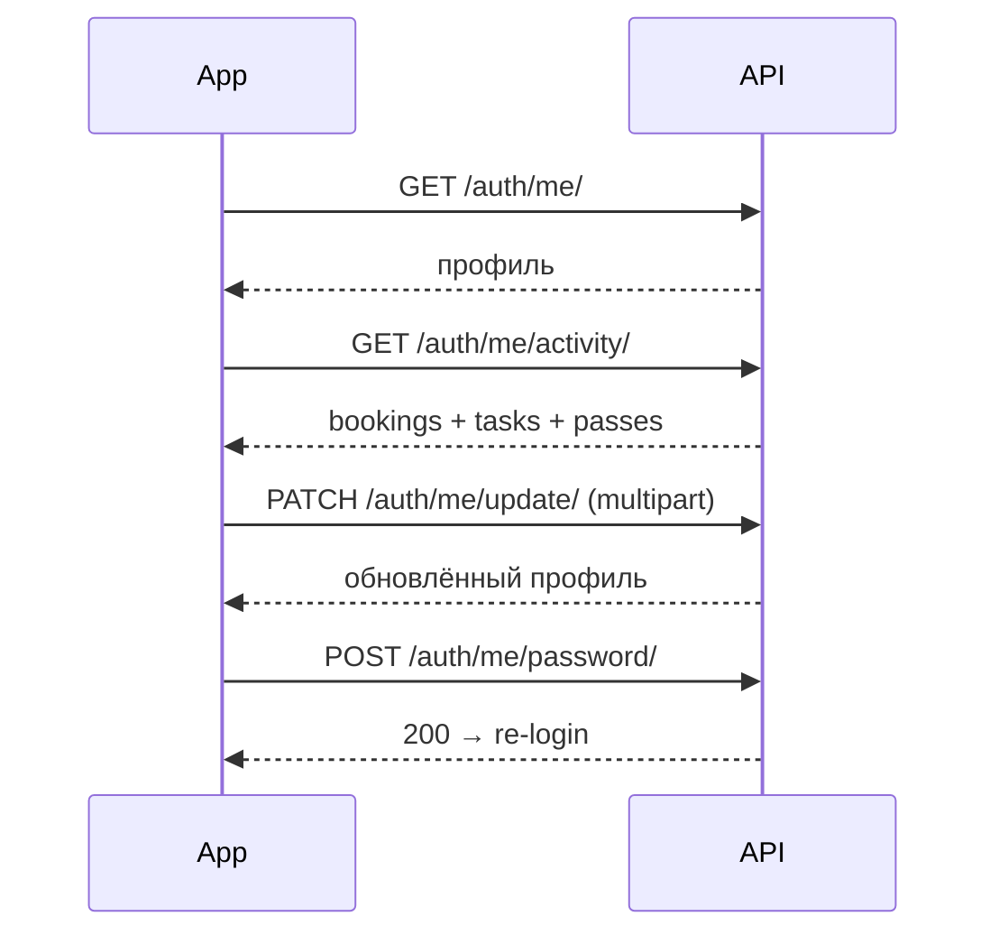

# Users — Профили пользователей

> Базовый префикс: `/api/v1/auth/`  
> Подключение: [← Основная документация](mobile_api.md)

Эндпоинты профиля текущего пользователя и администрирования пользователей (superadmin).

---

### ✅ GET /api/v1/auth/me/

> Получить профиль текущего авторизованного пользователя.

🔒 Требует авторизации

**Request**

```http
GET /api/v1/auth/me/
Authorization: Bearer <access_token>
```

**Response 200**

```json
{
  "id": 42,
  "email": "ivan.petrov@example.com",
  "first_name": "Иван",
  "last_name": "Петров",
  "full_name": "Иван Петров",
  "phone": "+77001234567",
  "position": "Менеджер проектов",
  "avatar": "https://your-domain.com/media/avatars/42/photo.jpg",
  "role": "employee",
  "company": {
    "id": 5,
    "name": "ТОО Астана Бизнес",
    "onboarding_completed": true
  },
  "is_email_verified": true,
  "date_joined": "2024-01-15T10:30:00Z"
}
```

**Ошибки**

| Код | Когда | Что делать мобильщику |
|-----|-------|----------------------|
| 401 | Токен истёк или сессия превысила idle/absolute timeout | Вызвать `/auth/token/refresh/` или перейти на экран входа |

---

### ✅ GET /api/v1/auth/me/activity/

> Краткая сводка активности для главного экрана: последние 5 бронирований, задач CRM и гостевых пропусков.

🔒 Требует авторизации

**Request**

```http
GET /api/v1/auth/me/activity/
Authorization: Bearer <access_token>
```

**Response 200**

```json
{
  "bookings": [
    {
      "id": 101,
      "resource_name": "Переговорная A-201",
      "start_time": "2024-06-15T09:00:00Z",
      "end_time": "2024-06-15T10:00:00Z",
      "status": "confirmed"
    }
  ],
  "tasks": [
    {
      "id": 55,
      "title": "Подготовить презентацию",
      "priority": "high",
      "deadline": "2024-06-20T18:00:00Z",
      "board_name": "Маркетинг",
      "board_id": 3
    }
  ],
  "passes": [
    {
      "id": 12,
      "guest_name": "Асхат Нурланов",
      "status": "active",
      "valid_from": "2024-06-15T08:00:00Z",
      "valid_until": "2024-06-15T20:00:00Z"
    }
  ]
}
```

| Поле | Значения |
|------|----------|
| `bookings[].status` | `confirmed`, `cancelled`, `completed`, `no_show` |
| `tasks[].priority` | `low`, `medium`, `high`, `urgent` |
| `passes[].status` | `active`, `used`, `expired`, `revoked` |

**Ошибки**

| Код | Когда | Что делать мобильщику |
|-----|-------|----------------------|
| 401 | Не авторизован | Обновить токен или войти заново |

---

### ✅ PATCH /api/v1/auth/me/update/

> Обновить поля профиля. Для загрузки аватара используйте `multipart/form-data`.

🔒 Требует авторизации

**Request (JSON — без аватара)**

```http
PATCH /api/v1/auth/me/update/
Authorization: Bearer <access_token>
Content-Type: application/json
```

```json
{
  "first_name": "Иван",
  "last_name": "Петров",
  "phone": "+77001234567",
  "position": "Менеджер проектов"
}
```

**Request (multipart — с аватаром)**

```http
PATCH /api/v1/auth/me/update/
Authorization: Bearer <access_token>
Content-Type: multipart/form-data
```

```
first_name=Иван
last_name=Петров
phone=+77001234567
position=Менеджер проектов
avatar=<binary file>
```

| Поле | Обязательно | Описание |
|------|-------------|----------|
| `first_name` | нет | Имя |
| `last_name` | нет | Фамилия |
| `phone` | нет | Телефон |
| `position` | нет | Должность |
| `avatar` | нет | Файл изображения (JPEG, PNG, WebP; макс. 5 МБ) |

**Response 200** — полный объект профиля (формат как у `GET /me/`).

**Ошибки**

| Код | Когда | Что делать мобильщику |
|-----|-------|----------------------|
| 400 | Неподдерживаемый тип файла или размер > 5 МБ | Показать требования к аватару |
| 401 | Не авторизован | Обновить токен или войти заново |

---

### ✅ DELETE /api/v1/auth/me/avatar/

> Удалить аватар текущего пользователя. Идемпотентен: повторный вызов при `avatar: null` тоже вернёт `200`.

🔒 Требует авторизации

**Request**

```http
DELETE /api/v1/auth/me/avatar/
Authorization: Bearer <access_token>
```

**Response 200** — полный объект профиля с `"avatar": null`.

**Ошибки**

| Код | Когда | Что делать мобильщику |
|-----|-------|----------------------|
| 401 | Не авторизован | Обновить токен или войти заново |

---

### ✅ POST /api/v1/auth/me/password/

> Сменить пароль текущего пользователя. Инвалидирует все активные refresh-сессии.

🔒 Требует авторизации

**Request**

```http
POST /api/v1/auth/me/password/
Authorization: Bearer <access_token>
Content-Type: application/json
```

```json
{
  "current_password": "SecurePass123!",
  "new_password": "NewSecurePass456!"
}
```

| Поле | Обязательно | Описание |
|------|-------------|----------|
| `current_password` | да | Текущий пароль |
| `new_password` | да | Новый пароль (мин. 8 символов, Django validators) |

**Response 200**

```json
{
  "detail": "Пароль изменён"
}
```

**Ошибки**

| Код | Когда | Что делать мобильщику |
|-----|-------|----------------------|
| 400 | Неверный текущий пароль или слабый новый пароль | Показать ошибки из `error.details` |
| 401 | Не авторизован | Обновить токен или войти заново |

---

## Администрирование (только superadmin)

> Эти эндпоинты недоступны обычным мобильным пользователям. Предназначены для внутренней admin-панели.

---

### ✅ GET /api/v1/auth/users/

> Список всех пользователей платформы с пагинацией, фильтрами и поиском.

🔒 Требует авторизации · роль `superadmin`

**Request**

```http
GET /api/v1/auth/users/?role=employee&company_id=5&is_active=true&search=ivan&ordering=-date_joined&page=1&page_size=20
Authorization: Bearer <access_token>
```

| Параметр | Описание |
|----------|----------|
| `role` | Фильтр по роли |
| `company_id` | Фильтр по ID компании |
| `is_active` | `true` / `false` |
| `search` | Поиск по `email`, `first_name`, `last_name` |
| `ordering` | `date_joined`, `-date_joined`, `last_login`, `-last_login` |
| `page` | Номер страницы (по умолчанию 1) |
| `page_size` | Размер страницы (по умолчанию 20, макс. 100) |

**Response 200**

```json
{
  "count": 42,
  "next": "https://your-domain.com/api/v1/auth/users/?page=2",
  "previous": null,
  "results": [
    {
      "id": 42,
      "email": "ivan.petrov@example.com",
      "first_name": "Иван",
      "last_name": "Петров",
      "full_name": "Иван Петров",
      "role": "employee",
      "company": {
        "id": 5,
        "name": "ТОО Астана Бизнес",
        "onboarding_completed": true
      },
      "is_active": true,
      "is_email_verified": true,
      "date_joined": "2024-01-15T10:30:00Z",
      "last_login": "2024-06-14T16:45:00Z",
      "avatar": null
    }
  ]
}
```

**Ошибки**

| Код | Когда | Что делать мобильщику |
|-----|-------|----------------------|
| 401 | Не авторизован | Обновить токен |
| 403 | Роль не `superadmin` | Скрыть раздел администрирования |

---

### ✅ GET /api/v1/auth/users/{id}/

> Детальная карточка пользователя со счётчиками активности.

🔒 Требует авторизации · роль `superadmin`

**Request**

```http
GET /api/v1/auth/users/42/
Authorization: Bearer <access_token>
```

**Response 200**

```json
{
  "id": 42,
  "email": "ivan.petrov@example.com",
  "first_name": "Иван",
  "last_name": "Петров",
  "full_name": "Иван Петров",
  "phone": "+77001234567",
  "position": "Менеджер проектов",
  "avatar": null,
  "role": "employee",
  "company": {
    "id": 5,
    "name": "ТОО Астана Бизнес",
    "onboarding_completed": true
  },
  "is_active": true,
  "is_email_verified": true,
  "date_joined": "2024-01-15T10:30:00Z",
  "last_login": "2024-06-14T16:45:00Z",
  "bookings_count": 12,
  "tasks_count": 7
}
```

**Ошибки**

| Код | Когда | Что делать мобильщику |
|-----|-------|----------------------|
| 401 | Не авторизован | Обновить токен |
| 403 | Роль не `superadmin` | Скрыть раздел |
| 404 | Пользователь не найден | Показать экран ошибки |

---

### ✅ DELETE /api/v1/auth/users/{id}/

> Безвозвратно удалить пользователя. Нельзя удалить себя или другого superadmin.

🔒 Требует авторизации · роль `superadmin`

**Request**

```http
DELETE /api/v1/auth/users/42/
Authorization: Bearer <access_token>
```

**Response 204** — тело пустое.

**Ошибки**

| Код | Когда | Что делать мобильщику |
|-----|-------|----------------------|
| 400 | Попытка удалить себя или superadmin | Показать сообщение об ошибке |
| 401 | Не авторизован | Обновить токен |
| 403 | Роль не `superadmin` | Скрыть действие |
| 404 | Пользователь не найден | Показать экран ошибки |

---

### ✅ POST /api/v1/auth/users/{id}/block/

> Заблокировать пользователя (`is_active: false`) и инвалидировать все его refresh-сессии.

🔒 Требует авторизации · роль `superadmin`

**Request**

```http
POST /api/v1/auth/users/42/block/
Authorization: Bearer <access_token>
```

**Response 200**

```json
{
  "detail": "User blocked"
}
```

**Ошибки**

| Код | Когда | Что делать мобильщику |
|-----|-------|----------------------|
| 401 | Не авторизован | Обновить токен |
| 403 | Роль не `superadmin` | Скрыть действие |
| 404 | Пользователь не найден | Показать экран ошибки |

---

### ✅ POST /api/v1/auth/users/{id}/unblock/

> Разблокировать пользователя (`is_active: true`).

🔒 Требует авторизации · роль `superadmin`

**Request**

```http
POST /api/v1/auth/users/42/unblock/
Authorization: Bearer <access_token>
```

**Response 200**

```json
{
  "detail": "User unblocked"
}
```

**Ошибки**

| Код | Когда | Что делать мобильщику |
|-----|-------|----------------------|
| 401 | Не авторизован | Обновить токен |
| 403 | Роль не `superadmin` | Скрыть действие |
| 404 | Пользователь не найден | Показать экран ошибки |

---

### ✅ POST /api/v1/auth/users/{id}/impersonate/

> Войти от имени другого пользователя (support/debug). Access-токен содержит claim `impersonated_by` с ID superadmin.

🔒 Требует авторизации · роль `superadmin`

**Request**

```http
POST /api/v1/auth/users/42/impersonate/
Authorization: Bearer <access_token>
```

**Response 200**

```json
{
  "access": "eyJhbGciOiJIUzI1NiIsInR5cCI6IkpXVCJ9...",
  "refresh": "eyJhbGciOiJIUzI1NiIsInR5cCI6IkpXVCJ9...",
  "user": {
    "id": 42,
    "email": "ivan.petrov@example.com",
    "first_name": "Иван",
    "last_name": "Петров",
    "full_name": "Иван Петров",
    "role": "employee",
    "company": {
      "id": 5,
      "name": "ТОО Астана Бизнес",
      "onboarding_completed": true
    },
    "is_active": true,
    "is_email_verified": true,
    "date_joined": "2024-01-15T10:30:00Z",
    "last_login": "2024-06-14T16:45:00Z",
    "avatar": null
  }
}
```

**Ошибки**

| Код | Когда | Что делать мобильщику |
|-----|-------|----------------------|
| 400 | Impersonate себя, другого superadmin или неактивного пользователя | Показать причину из `detail` |
| 401 | Не авторизован | Обновить токен |
| 403 | Роль не `superadmin` | Скрыть действие |
| 404 | Пользователь не найден | Показать экран ошибки |

---

### Важные детали для мобильщиков (Users)

#### Профиль — что можно менять

| Поле | `PATCH /me/update/` | Примечание |
|------|---------------------|------------|
| `first_name`, `last_name`, `phone`, `position` | ✅ | Частичное обновление (`partial=True`) |
| `avatar` | ✅ | Только через `multipart/form-data` |
| `email`, `role`, `company` | ❌ | Передаются в запросе, но **игнорируются** сервером |

#### Аватар

- Допустимые форматы: JPEG, PNG, WebP.
- Максимальный размер: 5 МБ.
- Сервер ресайзит до 400×400 px и сохраняет как JPEG.
- При замене аватара старый файл удаляется с сервера.
- `GET /me/` и ответы `PATCH`/`DELETE avatar` возвращают **абсолютный URL** аватара.
- `DELETE /me/avatar/` идемпотентен — безопасно вызывать повторно.

#### Activity feed (`GET /me/activity/`)

| Роль | `bookings` | `tasks` | `passes` |
|------|------------|---------|----------|
| `employee`, `company_admin`, `superadmin` | Свои + где участник | Назначенные (не архивные) | Свои созданные |
| `company_admin` | то же | то же | **Все пропуска компании** |
| `guest` | Свои | `[]` | Свои созданные |
| `reception`, `service_manager` | Свои | `[]` | `[]` |

- Лимит: **не более 5 элементов** в каждом списке.
- Сортировка: бронирования по `-start_time`, задачи по `-created_at`, пропуска по `-created_at`.
- Данные read-only — для деталей переходите в соответствующие разделы API (Bookings, CRM, Access).

#### Смена пароля

- После `POST /me/password/` сервер **инвалидирует все refresh-токены** пользователя.
- Текущий `access` продолжит работать до истечения (~15 мин), но refresh уже не сработает.
- Рекомендуется: после успешной смены пароля очистить локальные токены и выполнить повторный login.

#### Админ-эндпоинты

- Все `GET/DELETE /users/...`, `block`, `unblock`, `impersonate` — **только `superadmin`**.
- Обычное мобильное приложение для сотрудников/гостей эти эндпоинты не вызывает.
- `impersonate` возвращает токены целевого пользователя; в access JWT есть claim `impersonated_by` — полезно для audit UI.
- `block` немедленно инвалидирует сессии: заблокированный пользователь не сможет ни refresh, ни `/me/`.

#### Рекомендуемый flow профиля



---
